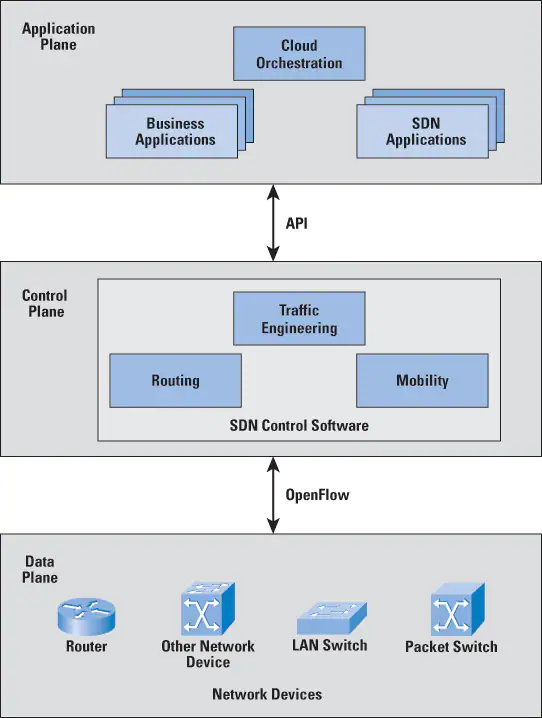

# CCNA notes

# Innholdsfortegnelse  
[Småting cheat sheet](#cheat-sheet-småting)  
[IPv6](#ipv6) 
  * [IPv6 multicast ranges](#ipv6-multicast-ranges)
  * [IPv6 link-local multicast addr](#ipv6-multicast-ranges)  

[Routing](#routing)  
* [AD](#administrative-distance)  
* [ospf](#ospf)  

[Switching](#switching)  
* [DTP](#dtp)  
* [VLAN](#vlan)  
* [Port-Sec](#port-security)

[Wifi](#wifi)
* [Wireless security](#wifi-encryptio-protocols)   
* [Cisco wireless infrastructure](#cisco-wireless-infrastructure)

[Dynamic ARP Inspection](#dhcp-snooping-and-dynamic-arp-inspection)  
[Spanning-Tree](#stp-etherchannel-and-vtp-vlan-trunking-protocol)  
[syslog](#syslog)  
[SDN og API](#intro-to-cisco-automaation-and-sdn)

# Cheat sheet småting

## Password recovery

    Må ha console access
    -Rett etter POST under bootstrap load, send ein BREAK cmd. 
    -Blir verande i ROMMON mode.  Gir tilgang til configuration register. 
        - Configuration register = Ein bunch med on/off switches, med values oppgitt i hex. 
        - Default value = 0x2102. 
            -3 quintet styrer lasting av NVRAM content. Endre frå 0000 -> 0100 for å ikkje laste NVRAM (startup-config). 
            HEX: 2102 -> 2142 (0010 0001 0000 0010 -> 0010 0001 0100 0010)
        - Reboot router. Laster factory default. 

    program load complete, entry point: 0x8000f000, size: 0x3ed1338  
    Self decompressing the image :  
    ####################  
    monitor: command "boot" aborted due to user interrupt  
    rommon 1 >   
    rommon 1 >  confreg 0x2142
    rommon 2 > reset 
    ..... boots to factory default 
    show startup-config #Viser gammal startup-config. 
    enable
    copy startup-config running-config
    conf t
    config-register 0x2102

## Subnet hauderekning
Number of networks = 2bits-available  
* Auker med power of 2 for kvar bit.  1,2,4,8,16,32,64,128,256 etc  
    * Starter med 1 for 0 bit og 2 for 1 bit. Deretter 2,4,8,16,32,64,128 etc. 
    * /32 = 0 bit = 1 network 
    * /31 = 1 bit = 2 networks
    * /30 = 2 bit = 2**2 = 4 networks. 

Number of hosts per network = 2bits-available -2  
* Kan ta available networks number og minus 2. 

## Multicast MAC-range
* 01-00-5E-xx-xx-xx = IPv4 Multicast mac
* 33-33-yy-xx-xx-xx = IPv6 multicast mac

## router software
EEPROM = Bootstrap location  (Electronic Erasable Programable ROM)  
Flash for IOS  
startup-config in NVRAM  
running-config in ram  

# Switch software
EEPROM = Bootstrap location   
Flash = Ios location  
startup-config in Virtual NVRAM  
    - Er eigentlig fil kalla config.text, stored in Flash.   
    - ios lager ein symlink/alias for config.text called startup-config.   
    - rommon for å editere config.text (til config.bak for restore, eksempel)  
running-config in RAM  

## IOS versions
filename build:
Platform(sw/ro) model number - feature set (ip base, advanced ip service etc) - Train(12.4)-throttle(24).rebuild (T5)
Trains = Major release
Throttles = Minor releases (Number in parantes)
rebuilds = ID bak nummer i parantes

# Emner
* Ethernet
* routing
* dynamic routing
* Vlan
* Switch security
* Application layer protocols
* ACL
* NAT
* WAN / VPN
* Security
* Wireless
* Mgmt protocols (snmp,hsrp,qos)
* Topologies
* automation and SDN

***

# CSMA/CD
Carrier Sense Multiple Access / Collison Detection
- Listen for signals
    - Sending = 5V. 
    - Multiple senders = 10V
    - Wait random time
    - Listen on carrier again. 
Collision domain - Group of devices that samtidig detect a voltage spike. 

## Ethernet 
Felter: 
-dmac 48bit
-smac 48bit
-Type 16bit
-Data 1500 bytes
-FCS (Frame Check) 32 bit  Er ein CRC
***
- Broadcast domain; Group of devices who receive L2 broadcasts. 

# IPv6  
## SLAAC  (stateless address auto confi)
Windows = Random address  
unix/linux/mac = EUI, FFFE i midten av mac-addres + flip bit 7.   

### EUI64
* Mac-address OUI + FF FE + int ID. 
* Eksempel:   

        Global IPv6 = 2012::99:/64
        Mac: 3C-58-C2-7A-A2-2E 
        OUI = 3C-58-C2
        ID = 7A-A2-2E

        3C-58-C2 + FFFE + 7A-A2-2E
        Flip 7th bit:  
        3C = 0011 1100 = 12 -> Flip 0011 1110 = 14 = 3E
        EUI64 = 2012::99:3E:58:C2:FF:FE:7A:A2:2E

## Subnet standards  
/32 på ISP level
/48 på Customers
/56 på sites. (Internal subnets)

## Address ranges  
* FC00::/7  Unique Local  (same as private ipv4)
* FF00::/8 = Multicast range. 
* FE80::/10 Link-local. 
* 2000::/3  Global Aggregatable unicast
* 2001:db8::/32  Documentation
* xx FFFE xx EUI64

## IPv6 Multicast ranges
* FF00 -> FFFF   
Multicast er delt opp for følgande ranges:   
* FF01::/16 - Node-local
* FF02::/16 - Link-local
* FF05::/16 - site-local
* FF08::/16 - organization-local
* FF0E::/16 - global

### Link-local multicast addresses
| Address | IPv4 | IPv6 | 
| ------  | ---- | ---- |
| All hosts | 224.0.0.1 | FF02::1 | 
| All routers | 224.0.0.2 | FF02::2 | 
| All OSPF Routers | 224.0.0.5 | FF02::5 | 
| All OSPF DRs | 224.0.0.6 | FF02::6 | 
| All RIPv2 router | 224.0.0.9 | FF02::9 | 
| All EIGRP | 224.0.0.10 | FF02::A | 

## ND Neighbour discovery
    Router sender ut RA (Router advertisement).  
        RA inneheld router mac, network prefix, ipv6 options (dhcp etc).   
    PC sender Neighboru adv (NA). 
        Inneheld Client MAC, client IPv6, +options  
    Neighbor solicitacion messages = ARP  
        Blir sendt til multicast group istadenfor broadcast. 

# routing 
## BGP 
    Path Vector
    EGP

## IGP's  
    Distance Vector protocols
        - Periodic routing table exchange
        - announce distance and path(vector) for routes to take. 
        - Algorthms used: 
            - Bellman-Ford (RIP) or Diffusion-update algorithm (EIGRP)
    Link State
        - Exchange link information with entire network. 
        - Link = Any network connection. (Route or interface)
        - Use SPF algorithm. 
    
    Div protocols: 
        - RIP - clasfull (ignores mask)
        - RIPv2 Classless (support mask)
        - IGRP (classfull, cisco proprietær. DEAD)
        - EIGRP
    
    Link state protocols:
        - OSPF
        - IS-IS

## Administrative Distance
### MEMORIZE THIS!!
| Protocol | AD  |  
| ---|---|
| Directly connected | 0 |  
| Static route | 1 |  
| EIGRP | 90 |  
| OSPF | 110 |  
| IS-IS | 115 |  
| RIP | 120 |  

## Metric 
Metric = Path selection in protocol.  Kun brukt inni kvar enkelt protokoll. 

| Protocol | Metric |  
| --- | --- |
| Directly Connected | -- |  
| Static | -- |  
| EIGRP | Bandwidth + delay (Delay of line, configurable) |  
| OSPF | Bandwidth |  
| IS-IS | Varies. (Custom metric set by admin) |  
| RIP | Hop count |  

## RIP
RIP = Suppetreg convergence.  
Sender full routing table every 30 sec.  
If one link is down, sends triggered updated. 

    # enable rip og enter config
    router rip
    #enable v2 to enable classess & CIDR
    ver 2          
    #turn off summering av unclassfull boundaries. By default summerer på class-boundary       
    no auto-summarry  
    # which networks to advertise. Must be connected and UP-state. 
    # RIP use class-rules for network-statement. 10.10.0.0 = 10.0.0.0 
    network 10.10.0.0
    network 192.168.0.0
    ------------------------------
        config t
        router rip
        version 2
        no auto-summary
        network 10.0.0.0
        network 192.168.20.0

## OSPF 

### OSPF network types
* Broadcast 
    * FDDI, Ethernet.  
    * DR/BDR 
* nonbroadcast / NBMA  Non-Broadcast Multi Access 
    * DR/BDR
    * 30/120 timers
    * Manual neighbor setup
    * X.25, Frame Relay. 
* Point-to-point
    * INGEN dr/bdr election
    * HDLC, PPP seriel interface
* Point-to-multipoint broadcast
    * INGEN dr/bdr election
    * 30/120 timers
* Point-to-multipoint non-broadcast
    * INGEN br/bdr
    * Manual neighbor. 

| network   | Mcast | DR | Timer |  
| -------   | -- | -- | --- |  
| Broadcast | Mcast | DR | 10/40 | 
| nonBroadcast | ---- | DR | 30/120 | 
| PTP | mcast | --- | 10/40 |  
| PTMpoint brcast | mcast | --- | 30/120 | 
| PTMpoint nonBrcast | --- | --- | 30/120 |  

### Discover ospf neighbors 
* sender ikkje periodiske routing updates. 

#### Hello protocol   
* Sender periodisk hello message. Inneheld:
    - Subnet / Mask
    - Hello interval  (default 10 sec, 30 sec on NBMA network. NBMA for old stuff som frame-relay)
    - Dead interval  (4x Hello)
    - Area ID
    - Authentication (når brukt) 
    - sturb area flag
    - MTU size
* Alle felt må matche for å bygge neighbor relationship. 

#### Router ID  
32-bit value, skreve i IP-addr format. Selection frå topp til bunn:
* Configured value
* highest IP on loopback interface 
* Highest IP on ANY active int. 

#### Neighbor table  
Router ID blir brukt for å bygge Neighbor Table. 
| Field | Value |
| ----- | ----- |
| Neighbor ID | 10.0.0.1 | 
| State | Init | 
| Dead Time | 40 sec | 
| Next hop Address | 192.168.1.2 | 
| Exit interface | Ge0/1 | 

### Exchange link information 
*  LSA (Link State advertisement) blir generert per advertised connected network. 
* LSA blir bundled og sendt til neighbor som LSU (Link State Update)
* Neighbor extract LSA from LSU.  LSA blir lagt til Link State Database. (LSdb)
* LSdb inneheld:  

| Field | Value |  
| ------   | ----- |  
| Router ID | 10.0.0.1 | 
| Link ID | 192.168.1.0 |   
| Link Mask | /24 |  
| LSA Type | 1 |  
| Router ID | 10.0.0.2 |  
| Link ID | 192.168.20.0 |   
| Link Mask | /24 |   
| LSA Type | 1 |  

### Calculate routing table 
* All routers participating in OSPF collect info about all neighbor links on all neighor routers in LSDB. 
* SPF run on LSDB.  Happen on all routers. 
* Dijkstra's algorithm. 
* cost = reference bw/interface bandwidth 
----------------------------------
### Summary  
* Hello protocol establish neighbors. 
* LSU are sent between neighbors to exchange LSA's. 
* LSdb is populated by LSA-data. 
* spf algorithm is run on lsdb to find shortest path. 

### Message types 
* Hello 
* Database Descriptor - LSA info about LSdb on router. 
* Link State Request (LSR) - Request for LSA from other routers if we are missing Link-state information. 
* Link State Update (LSU) - Contains LSA. 
* Link State Acknowledgement (LSAck) - Ack OSPF Messages. 

### LSA Types 
    * Type 1 - Router 
        * Describe links and costs. 
    * Type 2 - Network LSA
        * Describe routers in a broadcast network. 
    * Type 3 - Summary LSA 
        * Summary lsa between different areas. 
    * Other LSA - Beyond CCNA scope. 

### Databases 
    * Neighbor table 
    * Link State database (LSdb)
    * routing table 

### Passive interfaces 
Int not talking ospf. 

## OSPF Config
    conf t
    router ospf 1
    network 192.168.10.0 0.0.0.255 area 0
    network 10.0.0.0 0.0.0.3 area 0
    passive-interface gi0/1

## OSPF in broadcast network  
Environment with multiple OSPF routers on the same Broadcast domain.  
* OSPF neighbor relationship
* OSPF neighbors on broadcast network 
* Undesireable design. 

### OSPF Neighbors general. 
* Router A - RouterB - RouterC-   
Neighbor <->  Neighbor  <-> Neighbor 

### OSPF Neighbors on same segment. 
* Each router added to segment adds one neighbor to all other routers. 
    * Link down event vil generere LSA -> All neighbors. 
    * All routers vil recalculate og sende LSA to all neighbors. 
    * LSA can flood network. 
* How OSPF deal with this scenarion. 
    * Find RouterID on all routers. 
    * Chooses Designated router and backup designated router (DR / BDR).
        * Router with highest OSPF Priority = DR
        * Highest / 2nd highest RouterID as tie-breaker. 
    * DR / BDR form neigbor with eachother + all other routers. 
    * All other routers form neighbors with DR / BDR (Adjacancy)
    * Link down event: LSU til DR/BDR som so sender LSU til resten. 
* DR down event: 
    * Reelects DR/BDR.  BDR vil no bli DR. 
    * Ny router blir BDR. (Ny 2nd high router-id)
    * Når original DR er oppe igjen går den inn som DR-other, likt dei andre. 

### Troubleshooting OSPF  

## EIGRP  
* Distance vector  
    * Deler routing table information
    * Syncer via "Topology table".  
        * Differ frå ospf som bruker link-state. EIGRP deler ruting-tabell. 
* fast convergence
    * Består av 3 tabeller:  
        * Neighbor table - som i ospf
        * Topology table - likner på LSdb
        * routing table - Køyrer algorithm mot table for å bestemme best path. 
    * Diffusion update algorithm (DUAL) - algo brukt for path. 
        * Kalkulerer "Successor route". 
            * Successor route = Rute med best cost. 
            * Successor rute blir added to routing table. 
        * Kalkulerer "Feasable successor" - backup route. 
            * Second best cost rute. 
            * Øybelikkelig lagt til i ruting table dersom "successor route" forsvinner.
* Metrics - Uses composite metrics.  Can choose which metrics to use. 
    Video recomendation er unngå Calculated values.  Default configured er mest used.
    * Bandwidth - Configurable (bw setting)
    * Delay - Configurable  (ms)
    * Load - Calculated (amount of data activity over link)
    * Reliability - Calculated (Bit-error rate)

### EIGRP operations
* Topology table
    * Stable rutes has status: "Passive" i topology table. 
    * Downed rutes has status: "Active" i topology table. 
* Hello messages
    * Sent every 5 sec
    * Builds neighbor table. 
    * Bruker "Unreliable RTP"
        * RTP = EIGRP sin "tcp". 
        * Unreliable betyr vi dropper å sende ACK's for Hello messages. 
* Update messages
    * Sent mellom neighbors. 
    * Inneheld ruting table information. 
    * Bruker RTP
        * Sender ACK for update messages. 
* Network down event
    * Rute får status "Active" i EIGRP topology table. 
    * If has feasable successor, gets inserted to ruting table. 
    * Ruter send query message to neighbors. Asks for path to missing route. 
    * Neighbors svarer
        * Offer path if missing route is available. 
        * If hasn't alternative path, drops the missing too. 
        * If no reply message is received, route gets status "Stuck in active" (SIA). 
* Networ up event
    * Update message - Partial update
    * Neighbor use RTP to ack. 

### config & cmd
Veldig likt ospf.  
Router ID er likt som OSPF. (conf ID, loopback IP, highes int IP)  

    conf t
    router eigrp 1    # 1=AS-number, må vere likt på alle devices, blir sendt i hello messages
    network 10.0.0.8 0.0.0.3
    no auto-summary   #set by default i nyare Cisco, if not set summerer på classfull boundaries. 

    show ip eigrp topology
    # Viser topology table, med passive / active routes. 
    # Viser ruterID. 
    show ip eigrp neighbors
    # Viser neighbors - DUH

    #IPv6
    conf t
    ipv6 router eigrp 10
    router-id 1.1.1.1
    # no network statements like ipv4. 
    int ge0/1
    ipv6 eigrp 10 #Replaces network statement

    # Router process kan vere i shutdown, som eit interface. 
    conf t
    ipv6 router eigrp 10 
    no shutdown

# Switching 
## Vlan
* normal range 1-1005 
    * Stored in flash:/vlan.dat
* extended range 1006-4096
    * Stored in running-config. 
* 1002-1005 reserved for legacy protocols. 

## cmd 
    default interface gi0/1  #factory reset int-config
    default interface range gi0/1 -3 #same for range. 

### Native vlan definition
# PUGG NØYAKTIG DENNE DEFINISJONEN! 
The VLAN where traffic is sent over an 802.1q trunk link without a VLAN tag. 
On Cisco default is VLAN1

### DTP  
Port config modes  
* dynamic auto (default på alt moderne) - Passive, access port unless sees trunk negotiation på link. 
* dynamic desirable (Kan være default på gammalt utstyr) - Active trunk negotiation. 

DTP dynamic auto <-> dynammic auto = Access port

DTP Dynamic desireable <-> dynamic auto = Trunk port, all vlan allowed 

DTP dynamic auto <-> Static Trunk = Trunk port 

DTP dynamic auto <-> Static access = Access port 

DTP Dynamic desireable <-> dynamic desireable = Trunk port. 
 
### Port security
    Learn
        * Static 
        * Dynamic Secure
        * Sticky secure
    Actions
        * Protect - Drop non-secure mac. 
        * Restrict - Protect + log + increase violation counter
        * Shutdown - err-disable port + log + increase violation counter. 

* Port sec adresser dukker opp som Static i mac-table. 
    * show port-security
    * show port-security interface gi0/1
    * show port-security address

## Base port-sec  
* Disable DTP
* Force all ports as access in default
* Set all ports to unused vlan.  Don't use vlan1. 
    * prod vlan = not native vlan, not vlan1, not vlan for unused ports. 
* Port-sec. 
    * 3-5 mac's
    * violation mode = Restrict
* Trunks
    * Change native vlan to unused vlan.   

Switch default conf template:  
***
    hostname switch1  
    enable secret   
    username avo secret passord  
    ip domain-name  
    crypto rsa key??  
    ip ssh version 2  
    line con 0  
        password passord
        logging synchronous
    line vty 0 4
        login local
        transport input ssh 
        logging synchronous
    
    vlan 999
        name unused-ports
    vlan 1000
        name custom-native-vlan
    vlan 10
        name prod
    vlan 20
        name prod2
    interface range gi0/1-23
        switchport mode access
        switchport access vlan 999
        switchport nonegotiate
        switchport port-security maximum 3
        switchport port-security violation restrict
        switchport port-security
    interface gi0/24
        switchport mode trunk
        switchport nonegotiate
        switchport trunk encapsulation dot1q
        switchport trunk allowed vlan 10,20
        switchport trunk native vlan 1000
***

# TCP & UDP  
## Windows netstat  
    netstat -naop TCP
    -naop, reverse dns off, all, o=pid, protokoll.
    -naobp,  b=display exec

## Seq & Ack numbers  
* seq = 1st byte number beeing sent. 
* ack = received bytes + 1
* sack - Selective ACK, ACK received bytes + request missing bytes. 

## NTP  
* stratum 0 = closest to actual time (lært frå atomklokke)
* Stratum auker med 1 for kvart layer. 

### NTP conf  
    clock timezone CET +1
    clock summer-time CEST recurring  

    ntp server 1.1.1.1 

    show ntp status

## Syslog
#### Syslog conf
    logging 1.1.1.1
    logging source-interface loopback 0

### Syslog levels: 
* 0 - Emergencies
* 1 - Alerts
* 2 - Critical
* 3 - Error
* 4 - Warning
* 5 - Notification 
* 6 - Informational 
* 7 - Debug

DINWECA + Emergencies
7 til 0. 

## DHCP  
Description: Automatically provide IP-information / config.  
 * dhcp-discover broadcast 
 * dhcp-offer (ip,gw,dns)
 * dhcp-request (unicast)
 * dhcp-ack
 * DHCP Binding.  MAC <-> IP   (cisco speak for lease?)
 * Windows renews after half lease-time.

        show ip dhcp binding

### dhcp-conf  
    ip dhcp pool pool_192.168.0.0_24
    network 192.168.0.0 /24
    dns-server 1.1.1.1 2.2.2.2
    default-router 192.168.0.1
    lease 2  #days
    ip dhcp excluded-address 192.168.0.10
    ip dhcp excluded-address 192.168.0.20 192.168.0.30

### IP-Helper / dhcp-relay 
    - Bytter ut dhcp-discover med dhcp-server IP. 
    - Indikerer src-net til dhcp-server. 

### dhcp snopping 
    - Trusted ports - allowed to pass dhcp-traffic
    - untrusted ports - can't pass dhcp-traffic. 

## DNS
### DNS-conf  
dns-relay  

    ip dns server   #enable dns-server
    ip name-server 1.1.1.1 8.8.8.8  #enable dns-forwarding
    ip domain lookup  #enable domain lookup

# ACL  
## ACL types
* Standard ACL
    * Selects packets via Source IP only. 
    * Cisco rule - Applied to the interface closest to the destination device. 
    # Viktig rule - Cisco thingy
    * acl-number 1-99, 1300-1999 = reserved for std acl. 
* Extended ACL 
    * Cisco rule - Applied to the interface closest to the source device  
    # Same greia, må hugse rule fordi cisco. 
    * Selects based on: 
        * Protocol
            * ICMP type & code
        * src / dst IP
        * src / dst port 
        * state etc.  
    * acl-number 100-199, 2000-2699
* Max 4 ACL per interface. IPv4 in + out, IPv6 in + out. 
* Definition: 1 in and 1 out acl per L3-protocol per interface. 

### Standard ACL  
    ip access-list standard test  
        permit host 10.0.0.16 
        permit 10.0.0.16 0.0.0.1
    ip access-list 50 
        permit host 10.0.0.16

### Extended ACL  
    ip access-list extended test2
        permit tcp 10.0.0.16 0.0.0.1 host 192.168.10.10 eq 80
        permit icmp 10.0.0.16 0.0.0.1 host 192.168.10.10 
        permit tcp 10.0.0.128 0.0.0.0 host 192.168.10.10 eq 22
        deny ip any any 

* Traffic sourced from router are not filtered. 

#### TODO excersice 
* ACL Scenarion - multiple permit and deny in a statement. 

# NAT  
## NAT I sjuke sjuke cisco verden   
* Source NAT  
    * dst-ip in inside->outside  
    * Replace src-ip in outside->inside
    * inside keyword = src nat. 

Protocol to modify the source and/or destination IP address and/or prot number as a message traverse a router. 

* Inside Local IP    - IP
* Outside Global IP  - Internet-destination
* Inside global IP   - My src-nat
* Outside Local IP   -  

* Static nat = 1:1
* Dynamic nat = many:1 as needed.  (Std nat men med mange publics)
* Dynamic nat overload = std nat.  Many:1 + pat. 

        ip nat inside source static 10.0.0.10 201.20.20.10
        ip nat inside source list 1 interface gi0/1

        # dnat (port-forward)
        ip nat inside  source static tcp 10.0.0.10 80 int gi0/1
        ip nat inside source static tcp 10.0.0.10 8080 201.20.20.10 80

## WAN og VPN  
## VPN
* Phase 1 - IKE (Internet key exchange)
    * Auth (PSK, cert)
    * Key exchange parameter (DH gruppe)
    * Create SA
* Phase 2 - tunnel parameters 
    * Type of tunnel (AH, ESP) Authentication header, Encapsulating security paylod
    * sourc, dst net
    * Authentication of data (sha)
    * encryption protocol (AES)
    * Key Expiration information. 

### phase 1 setup   
    crypto isakmp policy 10 
        encryption aes 256
        authentication pre-share
        group 5
    crypto isakmp key MITT-PASSORD adddress 1.1.1.1

### Phase 2 setup 
    # ACL describing tunnel traffic 
    ip access-list extended VPN-ACL
        permit 10.0.0.0 0.0.0.255 192.168.10.0 0.0.0.255
    crypto ipsec transform-set MY-TRANSFORM esp-aes 256 esp-sha-hmac
    crypto map VPN-MAP 10 ipsec-isakmp
        set peer 1.1.1.1
        set pfs group5
        set transform-set MY-TRANSFORM
        match address VPN-ACL
    
    # Deny nat av ipsec-trafikk
    ip access-list extended NAT
    5 deny ip 10.0.0.0 0.0.0.255 192.168.10.0 0.0.0.255

    # Config ipsec-interface
    interface gi0/0
        crypto map VPN-MAP

### CLI vpn inspect  
        show crypto ipsec sa
        show crypto ipsec sa

## STP, Etherchannel and VTP (vlan trunking protocol)  

* 802.1d Spanning-tree
* 802.1W Rapid spanning-tree
* 802.1s MST 

* Select root bridge
* select best path to root bridge
* select port to block on "non-root" bridge. 
* Multiple connections between switches: 
    * Select root-path (lowest ID/MAC)
    * DP/NDP = Lowest port on receiving bridge = DP

* root bridge selection. 
    * Bridge ID = Priority + Switch mac-address
        * Priority = 4-bit Priority + 12bit VLAN-ID. 
        * Default priority 32,769  on vlan1. 
    * Root bridge = lowest bridge ID
    * lowest mac ends up as root by default. Due to default prirority + mac. 
* root port 
    * Port with best cost to root bridge. 
    * STP port cost 

    | port speed | port cost | 
    | ---------- | -------   |
    | 10 mbps    |   100    |
    | 100 mbps | 19 | | 
    | 1 gbps | 4 |  
    | 10 gbps | 2 | 

* Designated port 
    * Received and forwards frames
* non-designated port 
    * Drops infoming frames, does not send frames. 
    * Receive and proscess BPDU's. 
* Root bridge - all ports are DS 
* Root ports = Designated ports. 
* Non-root switches
    * Non-root ports. 
    * DS on one switch, non-DS on the other. 
        * Lowest bridge-ID (mac) is DS. 
        * Higher ID becomes non-DS and blocks frames. 

* BPDU containing:
    * Root bridge ID
    * Cost to Root bridge
    * Senders bridge ID
    * Port ID
    * STP Timers

### STP Process  
* Switchport begin BLOCKING
* Transition all ports to LISTENING, send BPDU for 15 sec 
    * Determine root-bridge
    * Transiton non-DS to BLOCKING
    * Not forwarding frames during LISTENING
* Transition all DS ports to LEARNING 15 sec 
    * Not forwarding frames. 
* Transition all DS-ports to FORWARDING

#### Process during failure event 
* Switch stops receiving BPDU
* Transition all ports to BLOCKING - 20 sec. 
* Transition all ports to LISTENING - 15 sec 
    * Transition non-DS ports to blocking
* All DS ports to LEARNING - 15 sec. 
    * Learn MAC-address, populated mac-table. 
* All DS ports to FORWARDING. 

# CISCO PUGG!   
* BLOCKING 20 sec
* LISTENING 15 sec 
* LEARNING 15 sec 
* FORWARDING 

### CLI cmd  
        show spanning tree
        show spanning-tree bridge detail (bridge-id for device)
        debug spanning-tree events

        spanning-tree mode rapid-pvst

## PVST+  
* STP per VLAN
* Egen root bridge for kvart vlan 
* Separate BPDU for each VLAN 

## RSTP+ 
* Port states 
    * DISCARDING
        * Drop all frames 
    * LEARNING
        * Accept all frames. 
        * Populate mac-table
        * does not forward frames
    * FORWARDING
        * Accept and forward frames

## ETherchannel 
* Building etherchannel 
    * Static / unconditional 
        * No protocol used
    * Port aggregation protocol (PAgP)
        * Cisco proprietry 
            * Two modes: 
                * Desirable - actively seeks to build link
                * Auto - waits for PAgP negotiation packet. 
        * LACP 
            * Active - actively seeks to build link 
            * Passve - waits for lacp negotiation packet.  
    * Speed / Duplex MUST match. On all 4 ports
    * Access/trunk VLAN config MUST match. 
        * Must match on interfaces in same switch. 
    * Up to 8 links per channel. 

### Etherchannel protocols and modes
* LACP 
    * Modes: Active / Passive
* PAgP 
    * Auto / Desireable
* Manual 
    * ON / Off

### Modes compatability table  

| --  | Off | on | auto       | desirable | passive | active | 
|-----|----|------|-----------|---------|--------| ----------| 
| Off | No |  No  |  No       |  No     |  No    | No        |
| On  | No | On | No | No |No  |No  | 
| auto| No | No | No | PAgP | No | No |
|Desirable | No | No | PAgP |PAgP |No |No |
|Passive | No | No | No | No | No | LACP |
|Active | No | No | No | No | LACP | LACP |

### CLI cmd  
    interface range gi0/0 - 1
        channel-group 10 mode active 
    interface port-channel 10 
        switchport trunk allowed vlan 10,20,30
    
    show etherchannel summary 

    # Add extra link to po
        new interface: Copy config from a channel-member. 

## VTP (Vlan Trunking Protocol)
* VTP VLAN database communication 
    * VTP domain name (case sensitive) - must be likt all switches 
    * VTP password (case sensitive, optional)
    * Connected via trunk port. 
* VTP Switch roles 
    * One switch = VTP Server 
    * The rest = VTP Client 
        * The rest CAN be VTP Server. 
        * MUST have minumum 1 server. 
        * VTP SERVER can update VLAN.
        * VTP CLIENT can only accept vlan from server. 
    * VTP Transparent 
        * Doesn not add vlan to database. Must be manually configured 
        * forwards VTP to ther switchs. 
        * Like "turning vtp off" on that switch. 
* VTP Revision numbers 
    * Revision number increased every time we make a update (add a vlan)
    * Server with highest revision number decides. 
* VTP Pruning 
    * Keeps vlan database the same over all devices 
    * Only needed vlans are added to trunk-links. 
* VTP Limits 
    * only vlan 1-1005
        * 1002-1005 legacy reserved 
    * Only exchanged on trunk links. 
    * VTP config stored in vlan.dat
        * Does not see vlan in running-config. 

### VTP Modes and actions  
| Server | Client | Transparent |  
| ------ | ------ | ----------- |  
| Originate | originate | ----  |  
| forward   | forward   | ----  | 
| synchronize| synchronize | ---| 
| Vlan in nvram | -- | vlan in nvram | 
| create/modifye/delete Vlan | ---  | Create/mod/delete vlan |  

### CLI cmd
    show vtp status 

    # IF VTP Domain Name = NULL 
    # VTP = OFF. Blir auto-configed if connected to configured VTP switch. 

    conf t
    vtp domain test-domian 

## Basic security concepts  
* Define threats  
    * Circumstande or event with potential to do harm to our assets (data, pc, router)
        * Hacker
        * virus / Malware 
        * Natural disaster 
        * A exploit  
        * Users   
* Define voulnrability 
    * A weaknes where threats can come in. 
* Define Exploit 
    * Mechanism to compromise voulnrability 
* Compare and contrast above

* Discuss mitigation techniques 
    * Software updates
    * Antivirus
    * Firewalls
    * Device security features
    * IPS / IDS
    * Encryption 
    * Physical security 
    * Password policies 
    * User training 

### Key security concepts 

### Security program elements 

### AAA
* Auth methods:  
    * Password auth 
        * eksempel:  line con 0 password cisco
    * Local username / password 
        * Eksempel: line con 0 local, username avo secret 123
    * Remote database 
        * eksempel: Tacacs 
* AAA 
    * Authentication - username/pw to give access
    * Authorization - Priviliges user have access to (user-mode, enable, command-specific)
    * Accounting - Log.  Who did what when. 
    * Options: 
        * TACACS+ - Cisco proprietery
            * Auth / authorization is seperate processes. 
            * All traffic is encrypted 
            * tcp 49 
        * Radius - IETF rfc, open. 
            * Auth / authorization in the same process 
            * Only encrypt password 
            * UDP 
            * Support 802.1x and SIP  

#### CLI CMD
    aaa new-model
    aaa authentication login RADIUS-DEMO group radius local 
    ip radius source-interface loopback0
    radius-server host 1.1.1.1 auth-port 1812 acct-port 1813
    radius-server key MY-SECRET
    line vty 0 4
        login authentication RADIUS-DEMO
        transport input ssh 
    line con 0
        login authentication RADIUS-DEMO

### Password policies and features 

### DHCP Snooping and Dynamic ARP Inspection  
* Describer rougue dhcp server 
* Describe dhcp snooping 
    * Trusted / Untrusted ports. Untrust all access ports, only trust uplink. 
* implemetn dhcp snooping  

        ip dhcp snooping # Enable global snopping
        ip dhcp snopping vlan 10 # enable for vlan10. All ports = Untrusted
        int gi0/24
            ip dhcp snooping trust  #set port as trusted 
        no ip dhcp snooping option # Turn off option82, dhcp-servers can be a bit fucked. 

        show ip dhcp snooping 
        show ip dhcp snooping binding #Tabell blir brukt av dynamic ARP. 

* Describe dynamic arp inspection 
    * Uses DHCP snooping information to protect against spoofed ARP
    * Looks at table to see where IPs are, and drops forged ARP. 
* Implementing dynamic ARP inspection 
    * Have to trust port of gateway. Not learned from DHCP so will drop ARP's. 

            conf t
            ip arp inspection vlan 10
            int gi0/24
                ip arp inspection trust  
            
            show ip arp inspection vlan 10

# WiFi   
5ghz 
* channel 52 -> 140 er DFS

## 802.11  
* Bruker CSMA/CA  Carrier Sense Multiple Access / Collision Avoidane  (detection på ethernet)
* 802.11 frame, består for det meste av 9 felt.   

| FC | DUR | ADD1 | ADD2 | ADD3 | SEQ | ADD4 | DATA | FCS |   
| -- | --- | ---- | ---- |- --- | --- | ---- | ---- | --- |  
| Frame Control | Duration | Addr1 | addr2 | addr3 | Sequence | Addr4 | Data | Frame Check Sequence | 

Frame control - ID type of .11 frame  
Dur - Control frame, indicates transmission time  
ADD1 - ADDR3 - src/dst mac + BSSID  
ADD4 - Only if frame passes within DS (distribution system) - AP <-> AP  
SEQ - fragment and sequense number of frame  
DATA - Payload  
FCS - Frame Check Sequence (CRC)  

## Wifi Encryption principles
* Wifi enc is Layer2
* Authentication 
    * username / pass
    * psk
* Encrypt
    * TKIP 
    * AES
* Validate Integrity 
    * CBC-MAC
    * GMAC

### wifi encryptio protocols  
* wep 
* WPA (Wifi protected access)
    * WPA 
        * stopp gap against wep 
        * TKIP for encryption/integrity 
        * avoid 
    * WPA2 
        * Released 2004
        * CCMP for encyption / Integrity 
            * AES encryption 
            * CBC-MAC integrity
            * Option for TKIP - not recomended 
    * WPA3 
        * Release 2018 
        * GCMP for encryption / integrity 
            * AES encryption 
            * GMAC integrity (Galvie Message Authentication Code)
        * More secure PSK
            * Looks more like DH key exchange. 
    * Deployment option 
        * Personal 
            * PSK 
        * Enterprise 
            * 802.1x (username/pass eller Certs)
            * EAP Extensible Authentication Protocol
                * LEAP - OLD, not use
                * EAP-FAST - OLD, not use. 
                * PEAP - Still used
                    * username / pass
                * EAP-TLS - Use this if possible.
                    * Need certificate
            * Connect to RADIUS / TACACS+

# Cisco Wireless Infrastructure   

### Basic wireless infrastructure 
* BSS = Group of wifi-clients going via central AP (istadenfor ad-hoc nett)
* BSSID = AP Mac-addr
* SSID (Service Set Identifier)
    * Layer 2 broadcast domain 
    * Basically eit vlan 
* AP can broadcast multiple SSID 

### Enterprise wireless infrastructure  
* Access ports to AP's
    * Trunk to Controller 
    * CAPWAP (Controll and Provisiong of Wirelesss Access Protocol)
        * Two tunnells, one for mgmt-traffic one for Data. 
        * GRE or VPN tunell 
* Mobility Services Engine 
    * Physically locate a device in the wifi. 
* DNA Center
    * Monitor all devices in the network (Switches, wifi, routers). 
* Heatmaps
* dhcp 
* Radius
* WiSM - WLC module, can be installed on Cat6500 / 7600 series. 

### Autonomous AP 
* Configure individually 
* Would need a trunk link to AAP to support multiple SSID 
* WLSE - CiscoWorks Wireless LAN Solution Engine. 
    * Simplify mgmt and deloyment of Autonomous AP.  Den tilgjengeliggjer: 
        * Dynamic RF mgmt 
        * network security
        * IDS 
        * self-healing
        * Monitor and reporting. 
* WDS - Wireless Domain services. 
    * IOS feature som kan bli installert på AP. 
    * Interacts with WLSE 
    * Collects and aggregate radio info from AP and forwards data to CiscoWorks WLSE. 

### Controller based wireless 
* Thin / Lightweight AP 
* Creates a BSS
* Up to 6K AP.  Largest cisco model 
* Up to 64K clients.  Largest cisco model
* On-prem controller 
* Cloud based - meraki 

#### Local AP
* Creates a BSS
* CAPWAP til WLC
* Virker ikkje uten wlc. 

#### Flex mode AP 
* Lager ikkje BSS ifølge Cisco, sjølv om den eigentlig gjer det.. 
* Kan gjere lokal switching mellom ein SSID og eit VLAN. 

### Wifi Controller features 
* Distribution System Port = Vanlige fysiske dataporter på WLC. Oftast kobla til trunk. 
    * LAG by default bundler alle distribution ports. At least all 8 in 8-port scenario. 
* Service port = Fysisk port reservert for mgmt.
* WLC QoS
    * Platinum - VOIP
    * Gold - Video 
    * Silver - Default level. Best effort. 
    * Bronze - Guest access, lowest bw. 

### Infrastrucutre requirements for enterprise wifi 

## Config WLC  
* Create dynamic interface - virker som vlif på sw 
* Create WLAN and associate it with Dynamic interface 

        Controller tab -> interfaces -> New 
            interface name = MY-NEW-WLAN
            vlan ID = 20
             Physical port number wlan skal vere knytt mot 
            IP-address / mask / gw 
            dhcp-server
            ...Repeat for each WLAN. 
        WLAN tab -> new 
            type - wlan 
            profile name 
            SSID
            ID
            apply 
            Select interface 
            Security tab -> 
                WPA2
                AES
                PSK
            Enable. 

## Network services  
### HSRP 
* active/standby
* Høgste Priority is active.
* default priority = 100 
* Virtual IP har virtual MAC 
* Hello messages between peers 
* Standby begynner å svare på virtuel mac når hello timers er død. 
* No preempt by default.  
* Kan sette preemt manually
* defaults
    * Hello 3 sec 
    * hold time 10 sec 
* HSRP MAC:
    * V1: 0000.0C07.ACxx (xx = Group number in hex)
    * V2: 0000.0C9F.Fxxx (xxx = Group number in hex)
* VRRP Mac: 
    * 0000.5E00.01xx (xx=group number)
* GLBP (Gateway load balancing protocol)
    * 0007.B400.xxyy (xx=group number, yy=AFV)

#### HSRP config 
        interface gi0/1
            standby 10 ip 10.0.0.1 (10=group number)
            standby 10 priority 110
            standby 10 preempt
        inteface gi0/1
            standby 10 ip 10.0.0.1
            standby 10 priority 90 

### QoS 
* Queues 
    * FIFO 
        * Equal priority 
        * different needs
    * Weighted Fair Queue
        * Traffic queued in flows. (SRC<->DST based)
            * Each flow have equal priority. 
* Barriers to voip 
    * Congestion 
        * Too much traffic
        * Dropped / Delayed packets 
    * Delay 
        * Code delay - Fixed (time to format data)
        * Packetization - Fixed Time it takes to create packet. 
        * Queuing delay - variable (Time a packet waits in a queue before being transmitted)
        * Serialization delay - Fixed - Time it takes to move from queue to wire. 
        * Propogation delay - variable (time to traverse wire)
        * De-jitter - Fixed (Time to remove jitter)
    * Jitter = variable delays in message delivery. 
    * VOIP 
        * max latency = <150ms
        * Jitter < 30ms
        * Loss < 1%
        * BW 30-128kbps 
    * Video 
        * Latency < 200-400ms
        * Jitter < 30-50ms
        * loss < 0.1-1%
        * BW 384kbps - 20mbps

#### QoS operation 
* Classify traffic (Voice, Data, Video)
* Mark traffic (@Layer2 or 3)
    * Field in header saying traffic-type. Detirmines what queue to put in 
* QoS Policy - queues 
    * FIFO 
    * WFQ  - Wighted Fair Queue
        * Default on most devices. 
        * Each flow gets one queue
        * Each queue/flow gets equal priority  
    * CBWFQ - Class Based Weighted Fair Queue
        * Uses header markers to put traffic in a seperatee queue
        * All priority traffic in one queue
    * LLQ  - Low Latency Queuing 
        * Higher priority on this queue
* Trust boundaries 
    * Where we apply QoS marking. 
    * Mark as close to the source as possible. 
    * Usually marked at end divice in modern equipment. 
* Integrated Services (IntServ)
    * End to End QoS priority 
        * Devices in network are communicating to create a path for priority-traffic. 
    * Not used often
* Differentiated Services (diffserv)
    * Priority queueing only applied per device 
    * Common way. 
    * Priority queuing applied per device. 
        * Devices do not communicate, many islands. 

### SNMP 
* SNMP Agents 
* SNMP Manager

#### traps 
* Device sends alert @event 
#### Walks 
* polling the agents. 
* Walks the MIB tree. 

#### MIB 
* Management Information Base 
* Database of device properties (alt eg kan polle)
* MIB numbers = Identifier of a property. 
* Hierarchikal 

#### Versions  
* v2c - similar to v1
    * Community string to authenticate 
    * read-only or write access. 
    * v2c added bulk data collection mechanism. 
    * Is clear text. 
* v3
    * SNMP view
        * Allow access to only certain MIB's 
        * Encrypts communication 
        * Authenticate devices
            * Provide different security levels

* Config beyond scope.. 

## Cisco Topologies and Troubleshooting (general + ciscoCCNA specific)

### Virtualization principles  
meh 

### Cisco network topologies 
* SOHO 
* Cisco Network Design Model 3-tier
    * Core / Dist / Access
    * Access
        * L2
    * Distribution 
        * L3
        * Distribute network to access alyer 
        * Filter traffic (ACL/firewalling)
        * Routing policies
    * Core 
        * Highspeed traffic between Distribution. 
        * No filterering or policies. 
        * Limit changes
    * Unrealistic. 
        * too expensive
        * Unnesecary devices. 
        * Use 2-tier or 1-tier insted 
* Collapsed core 2-tier 
    * Core + Distribution on same devices. 
* Cloud services 
    * Public cloud
    * Private cloud
    * Hybrid cloud
    * IAAS - server/storage/memory etc. 
    * PAAS - HW + software (db for eksempel). 
    * SAAS - gmail

### CDP / LLDP 
* CDP pakker
    * 60 sec default send timer
    * 180 sec default holdtime
    * Device ID
    * Software version 
    * Platform  (HW)
    * Address
    * Port ID
    * Capabilities (switch / router/L3-sw)
    * VTP Mgmt domain
    * Native VLAN ID 
    * Duplex (interface cdp is leaving)
    * QoS informatoin 
    * PoE info. 
* LLDP 
    * 30 sec Default send timer
    * 120 sec Default hold time
    * TLV - Type Length Value
        * Can include whatever the implementer wans. Commonly:
        * Chassis subtype
        * Port 
        * System name
        * Port description 
        * Capabilities 
        * mgmt address
        * Vlan trunk info 
        * Speed/duplex info 
        * Can include custom info if the option is supported by the vendor. 

#### CLI cmd
        no cdp run #turn off cdp. 
        cdp run # enable cdp 

        #LLDP 
        show lldp 
        conf t
        lldp run #enable lldp 

        show lldp neighbours
        show lldp 

## Intro to Cisco Automaation and SDN   
### Controller based networks 
* Control plane 
    * Creates forwarding logic 
        * routing tables
        * STP port states
        * mac address tables 
        * Redundancy protocols
        * tunneling protocols 
* Data plane 
    * Forwards frames/packet 
    * Reads mac table
    * read ruting table 
    * read arp table 
    * Read config 
    * Forward frames
* Management plane 
    * Used for configuration of device
    * snmp
    * ssh
    * telnet
    * http/s
    * netconf / api 
* API 
    * Definition - Method of sending instruction / information in and out of a software system. 
    * Soutbound API 
        * Defines the way the controller should interact with application plane. 
        * Data from central controller to device. 
        * Enable a controller to communicate with apps in the application pane. 
            * NETCONF (use RPC & XML, SSH for transport)
            * Openflow
            * OnePK - Cisco proprietær
            * OpenFlow - Imperativ model.  Detaljerte instruksjoner. 
            * OpFlex - Meir åpen enn openflow, tillater devices å styre meir korleis dei oppnår målet.  Declarativ model. 
    * Northbound API 
        * Define the way controller should interact with data plane. 
        * Send from device to Controller. 
        * Enable controller to communicate with devices on network data plane
            * OSGi (Java Open Services Gateway Initiative)
            * REST (http/s for transport. JSON/XML for data-formating)

* SDN Solutions 
    * Open Daylight (opensource)
    * Cisco ACI (Uses APIC - Application Policy Infrastructure Controller, is controller for aci)
    * Cisco DNA

### Cisco SDN 
* Centralised control plane
* to-way communication.  devices<->controller

* Underlay / overlay 
* Controller 
* Fabric 

#### VXLAN 
* Original ethernet frame encapsulated in vxlan. 
    * VXLAN header 
    * UDP Header 
    * src IP 
    * dst IP 

#### Cisco DNA Center 
* Need two cisco dna-center servers. 
* Terms: 
    * Fabric Edge Node
        * Device connected directly to clients.  L3-switch usually 
    * Fabric Border Node 
        * Sits between a device supporting DNA and one that doesn't. WAN<->Fabric
        * DNA <-> ACI border er også border node.  Basically edge of fabric. 
    * Fabric Control Node 
        * Any device that is able to support the function of LISP Map Server. 
        * LISP used as Control Plane protocol in DNA 
        * LISP - Locator Identifier seperation Protocol
        * Special hw strong enough to hold the LISP map table and communicate it to other devices. 
        * LISP MAP SERVER 
            * Contains map table
                * EID - endpoint ID. IP of endpoints, single/subnet. 
                * MAC - MAC addr of endpoint. 
                * RLOC - Ruter locater.  
                    * Identifier given to each device in fabric. 
                    * IDs device where endpoint is. 
* Access Control Lists / Security policy 
    * DNA use Sec policy instead of ACL. 
    * Sec Policy: 
        * Apply policy to mac-addr / IP-addr. 
        * Maintains same policy when device moves around the network. 
* Features 
    * Prime
        * Single config/monitor interface
        * Inventory / topology discovery 
        * Day 0 config 
        * Wireless/wired mgmt in same interface
        * SWIM (Software image managemet) - upgrade sw, enforce sw-versions. 
    * DNA 
        * All the above, pluss: 
        * Easy QoS deployement 
        * Device 360 / client360 health status 
        * Client network performance stats 
        * Path trace 
        * Encrypted traffic analysis 

* Cisco ACI  Application Centric Infrastructure 
    * Nexus 9K hw 
    * DC use
    * Application policy infrastructure Controler (APIC)
        * Equivelant to DNA server. 
        * Central controller for data plane 
    * End Point groups (EPGs)
        * Hosts connected to the network. 
        * Can apply sec policies to EPGs
    * Uses spine-leaf

### Communicate with API  
* HTTP verbs
    * GET
    * POST
    * PUT  - update
    * DELETE
* REST Based API
    * Uses HTTP-like structure. 
    * Client/Server based 
    * Stateless
        * Do not store information from requests to make decisions on future requests. 
        * Each requests is self-contained. 
    * Cacheable
        * Be able to store information that haven't changed. 
    * Uniform interface - out of ccna scope
        * Consistent way of interaction 
    * Layered system (CCNA out of scope) 
    * Formating is XML or JSON. 
* REST Verbs 
    * CRUD
        * Create
        * Read
        * Update
        * Delete 
    * URI 
        * Universal Resource Identifier

            https:///sandbox.cisco.com/dna/api/v1/device  
            ----------hostname------------URI--------
    * Variable types
        * integer  1,2,3
        * Signed integer -1, -2, -3
        * Floating point 1.23654
        * Text  - hallo
        * Date - 01.06.2007
    * Variable list / Array 
        * list01 = ["Gi0/1", "gio/2]
    * Dict
        * Dict 01 = {"ip-address" : "10.0.0.1", "ip-address" : "10.0.0.2", }
* Encoding DATA for the API 
    * HTML 
    * XML
    * JSON 
* JSON encoded data

        {
            "response" : {
                "macAddress" : "f8:7b:etc", 
                "serialnumer" : "aytru3847", 
                "uptime" : "79 days"
            },
            "version" : "1.0"
        }
    * Key-Value pairs. 
        * Key in quotes
        * : is sperator 
        * "Value in quotes"
        * End in comma. 
        * Ingen komma på siste før closing bracket
    * {} = Dict ?? 
    * [] = List ??

### Understand Network Configuration Automation Utilities 
### Network configuration Automation 
* Avoid config drift 
* Avoid Stale configuration. 

* Config mgmt tools 
    * Ansible
    * Puppet 
    * Chef 
* Components
    * Devices
    * Templates
    * Variables
    * Logic to implement solution. 

#### Ansible terminology  

| Component | Ansible term | Languange |  
|-----------|--------------|-----------|
| Logic | Playbook |  |
| Devices | Inventory | |
| Templates | Templates | Jinja2 |
| Variables | Variables | YAML |

* Ansible use PUSH to communicate with devices. 
    * Ansible always initiate. 
    * PUSH use SSH or NETCONF
        * NETCONF use XML formated file. 

### PUPPET  
* Uses agent on device
    * TCP 8140
* Uses PULL
    * Device agent PULL from Puppet server. 
    * Device initiates. 
* If device does not support AGENT: 
    * Set up a proxy agent. 
    * A server act as AGENT, and SSH to network device. 

| Component | Puppet term | Languange |  
|-----------|--------------|-----------|
| Logic | Manifest | |
| Devices | Resource / Class / Module | | 
| Templates | Templates | |
| Variables | Variables | | 

### CHEF  
| Component | Puppet term | Languange |  
|-----------|--------------|-----------|
| Logic | Recipe / Runlist | |
| Devices | Resources | | 
| Templates | Cookbook | |
| Variables | Variables | | 

* Uses agent and PULL like puppet. 
* tcp 443
* Chef cookbook syntax ser ut som YAML. 