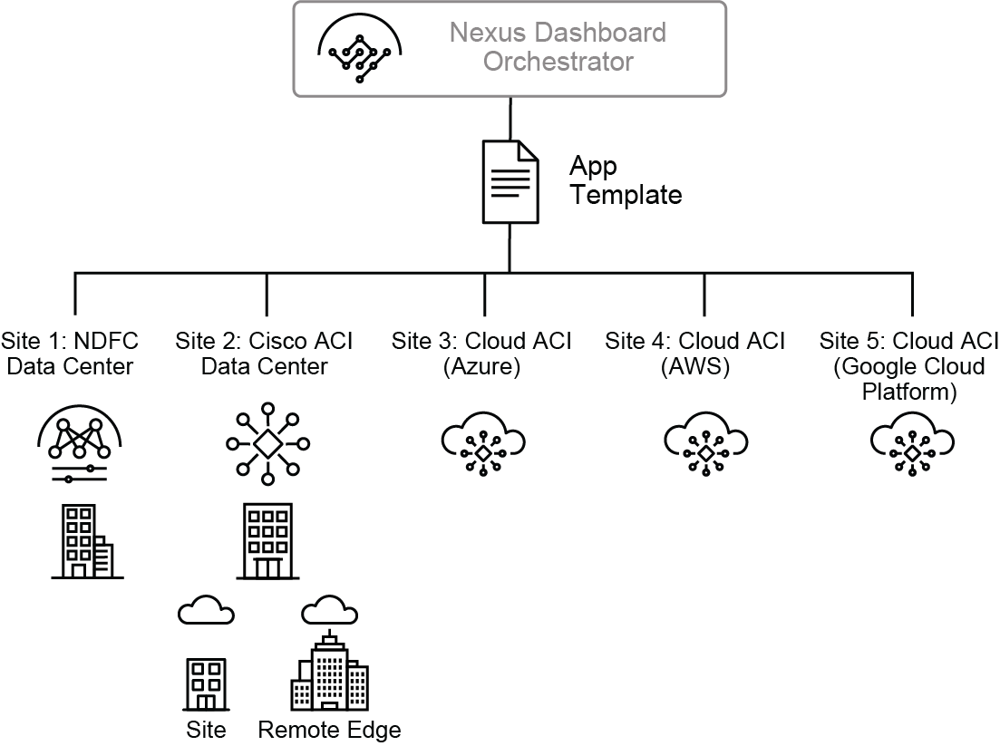
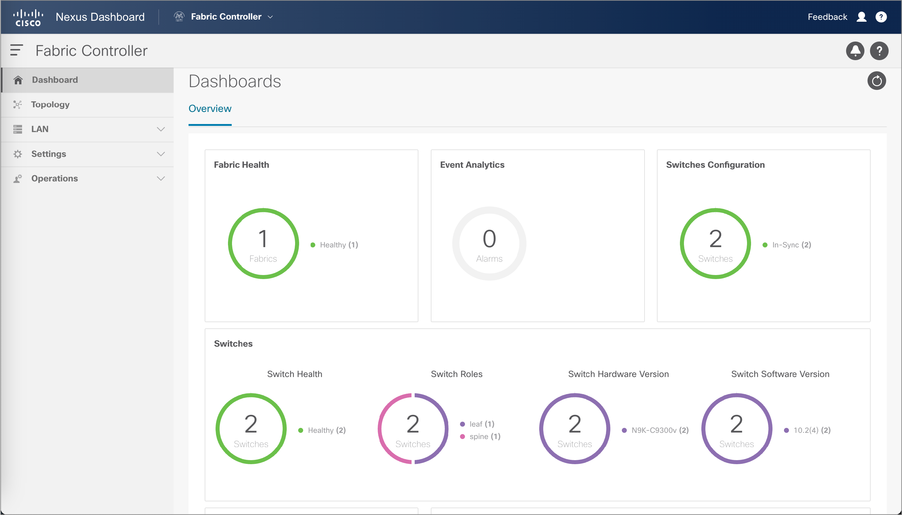
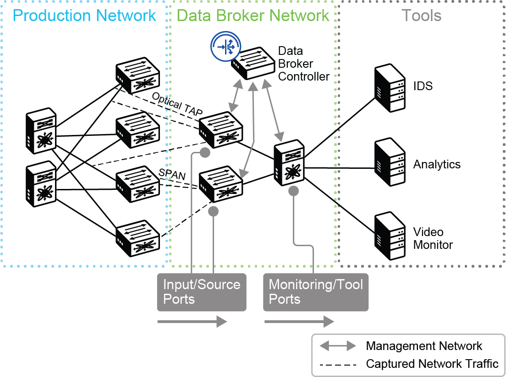
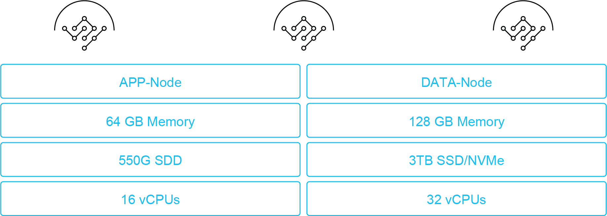
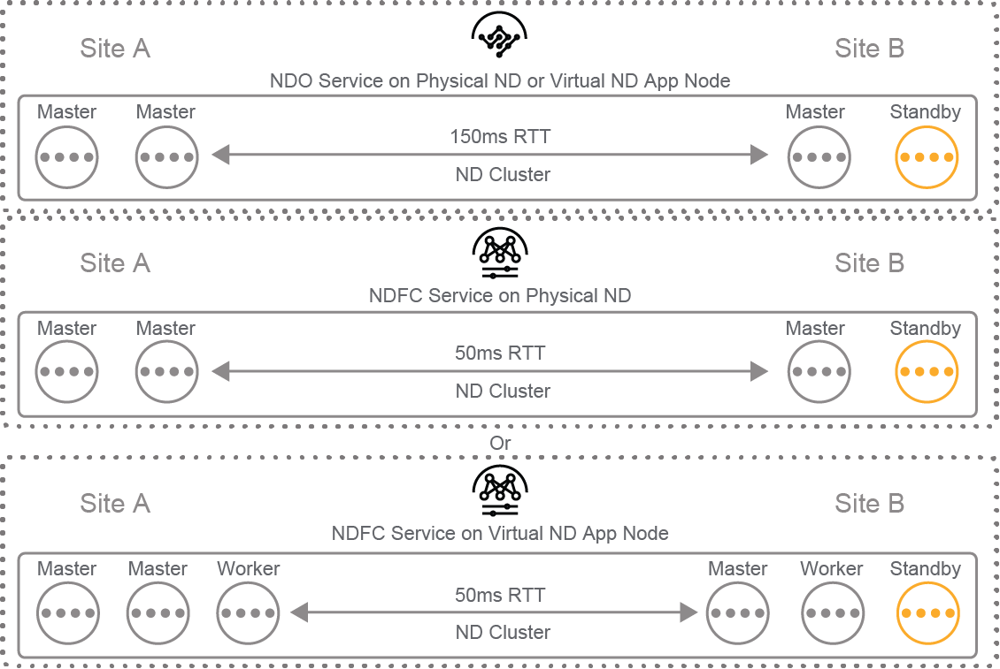
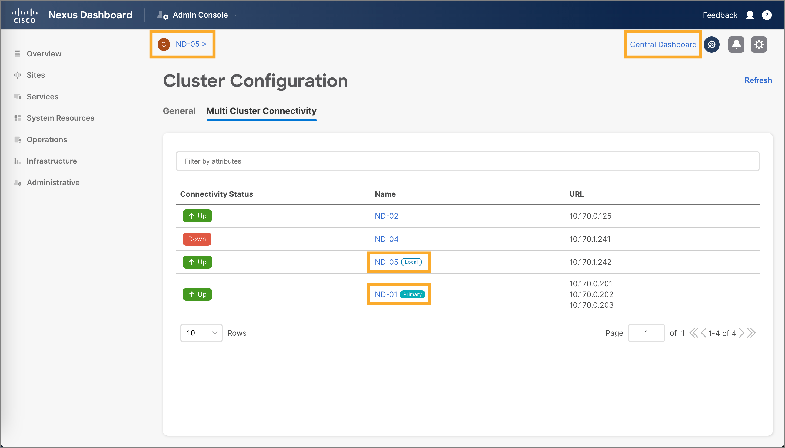
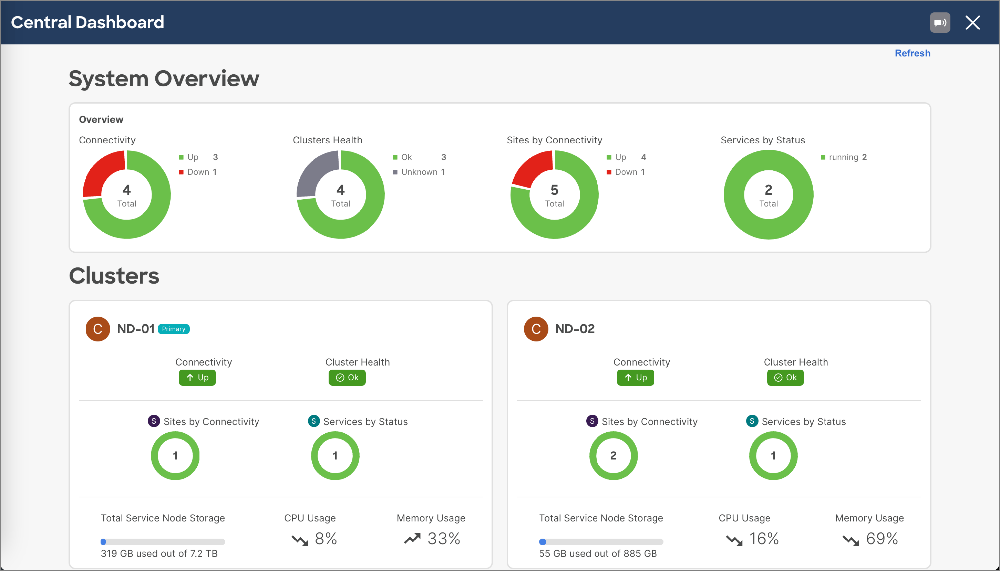

[TOC]

# 1 Nexus Dashboard Essentials

## Nexus Dashboard Platforms
### The Need for Day-2 Operations Tools
**Video Transcript**
Welcome to this video that will help you understand the need for day 2 operations tools in a modern data center. The term day 2 refers to a phase in the life cycle of a solution. While this phase includes managing, monitoring, and optimizing the solution, the day 0 phase includes designing the solution. And the day 1 phase includes installing and configuring it.

Powerful tools are needed to successfully perform day 2 operations because data centers have become extremely complex. The modern data center must support many different components, including physical and virtualized servers and a wide range of applications, each of which may be distributed in different locations.

Adding to the complexity, modern data centers often exist in hybrid environments that run workloads in many different functional areas, such as Cloud, IoT Edge, and colocation. And each of these areas has its specific operation procedures. Furthermore, data center traffic continues to increase at an astounding rate.

Let's take a look at some specific challenges presented by the complexity of the modern data center environment. Distributed data sources, siloed data stacks, multiple telemetry sources, and disjointed operations infrastructure make for fragmented insights.

Such lack of integration means no correlation of events in multiple systems and a high mean time to recover from any incidences. All these challenges translate to a high total cost of ownership.

To handle this complexity, you need a high degree of automation. You also need a high degree of visibility, which in turn helps with security. The Cisco Nexus Dashboard provides both automation and visibility. Cisco Nexus Dashboard is a unified automation platform that enables you to integrate services that focus on the day 2 phase.

Cisco Nexus Dashboard provides the following services, Insights, which is a comprehensive solution for analysis, trending, anomaly detection, alerting, and much more, Orchestrator, a solution to set up and operate multisite fabrics, Data Broker, a solution to build a packet broker network for further analysis, Fabric Controller, a solution to deploy Cisco NX-OS-based VXLAN fabrics, and Fabric Discovery, which is a solution to monitor Cisco NX-OS fabrics, and SAN Controller, a solution to deploy and monitor Storage Area Network, or SAN, fabrics. All of this is done through a single pane of glass where you can see them all in one place.

You should now understand the need for day 2 operation tools in a modern data center and the specific challenges presented by the complexity of the modern data center environment. You should also understand what is needed in order to handle this complexity and be familiar with the services that the Cisco Nexus Dashboard can provide to help you deal with that complexity. Thank you for watching this presentation on the need for day 2 operations tools.

**Text**

The amount of data that is transferred when the applications’ resources are consumed has grown rapidly and will continue to grow further. The implementation of new services leads to a demand for higher bandwidths and the network infrastructure must cope with data growth. As a result, the networks need to be modernized, scaled up and out, and upgraded to accommodate these needs.

In the modern day and age, workloads run in various infrastructures and environments. These include cloud, data center, Internet of Things (IoT) edge, and colocations. Each of these tools has specific setup and operation procedures.

When you have workloads stretching between an on-premises data center and the cloud, you have the challenge of connecting the two platforms where your application is running. Furthermore, the application needs to be designed in such a way that it can be distributed in various locations. The containerized architecture of modern applications allows you to do just that.

To deploy applications in these environments, and especially to scale them, the best strategy is to use automation. Automation will give you predictable results and accurate deployment. Once your application is deployed, you will need visibility into it to monitor how it is running and to see if you need resource adjustments.

Another aspect that you need to consider when you deploy your applications in multiple locations is security. Technologies exist to enforce and monitor security policies so that your data is secure, and your application is compliant.

In these diverse environments, you are faced with the following challenges:

- **Fragmented insights** between technology silos
- **No single pane of glass** to monitor the whole environment
- **No correlation** for the same events in multiple systems
- **Disjointed operations infrastructure** among different technology silos, such as network, storage, virtualization, application deployment, and the compute environment
- **High total cost of ownership** because systems are not integrated
- **Distributed data sources**
- **Siloed data stacks** for the same application in multiple locations—on-premises and cloud
- **High mean time to recover** because of the complexity of the deployment
- **Multiple telemetry sources** depending on the location where the application is running

To address these challenges and to be able to successfully manage such environments, the Cisco Nexus Dashboard is a platform that helps you unify management and monitoring with different applications that run on top of it.

The Cisco Nexus Dashboard is a platform for the following services:

- **Insights:** A comprehensive solution for analysis, trending, anomaly detection, alerting, and much more
- **Orchestrator:** A solution to set up and operate multisite fabrics
- **Data Broker:** A solution to build a packet broker network for further analysis
- **Fabric Controller:** A solution to deploy Cisco NX-OS-based VXLAN fabrics
- **Fabric Discovery:** A solution to monitor Cisco NX-OS fabrics
- **SAN Controller:** A solution to deploy and monitor SAN fabrics

**Note**

Within a solution lifecycle, Day-0 stands for architecture and design, Day-1 includes activities such as installation, setup, and configuration, and Day-2 operations include day-to-day management, monitoring, and optimizing the solution. In your case, Cisco Nexus Dashboard is a platform that lets you deploy tools that focus on the Day-2 phase. One example of such a tool is Cisco Nexus Dashboard Insights.

### Cisco Nexus Dashboard Insights Application Use Cases
**Video Transcript**
In this video, we're going to take a look at four services that you can integrate with Cisco Nexus Dashboard and the use cases that each service provides. Let's start with the Cisco Nexus Dashboard Insights, which is a comprehensive analytics tool that simplifies and automates root cause analysis, troubleshooting, and remediation of network issues. The other insight use cases include identify, locate, analyze, and remediate the cause of a problem, error and packet drop detection, automated alerts and alerts Explorer, pre-change analysis, which allows you to model intended network changes so you can determine whether the changes will produce the desired results and compliance alerts, end-to-end workflows for automated problem remediation, advisories on the impact of an upgrade, workload migration and prevention of outages, and device hardening check advisories applicable to your network and software and hardware recommendations.

With Insights, you also get product security incident response team, or otherwise known as PSIRT, and end of life notices on software versions and equipment that you have in your network, and attack assist to facilitate log collection and working with TACACS. These functions help you reduce mean time to identify and mean time to repair, save on operational costs, increase network availability, prevent hardware-related issues, and increase the productivity of your IT staff.

The primary use case for the Cisco Nexus Dashboard Orchestrates, or otherwise known as NDO, is configuring, orchestrating, and monitoring multiple data center sites with a common configuration. NDO can be used to manage multiple data center sites, such as Cisco Nexus Dashboard Fabric Controller, or NDFC-based sites, Cisco Application Centric Infrastructure-based sites, or otherwise known as ACI, and Cisco Cloud ACI sites. Regardless of the site type, you can use the same procedures to deploy network configuration elements to multiple sites. And because the NDO deploys all the configuration necessary to have stretched network structures, you can have mixed workloads with some applications or components running in the on-premises data center network, and some running in the public cloud.

Use cases for the Cisco Nexus Dashboard Fabric Controller application include comprehensive management and automation for all Cisco Nexus and Cisco multi-layered distributed switching, otherwise known as MDS platforms, powered by Cisco NX-OS, including management, automation, control, monitoring, and integration for deployments spanning LAN, SAN, and IP fabrics for media fabrics. Zero-touch provisioning of new VXLAN EVPN fabrics in private and hybrid cloud deployments. Onboarding of existing VXLAN EVPN fabrics into Cisco NDFC for monitoring and configuring. And providing a single pane of glass for data center fabrics.

The Fabric Controller Overview panel serves as a single pane of glass where you can quickly spot irregularities in the Fabric. A few of the many panes that are available for the overview panel are shown here. For example, there is a Fabric health pane, which shows you the health of your Cisco NDFC-based Fabrics, the event analytics pane, which shows you any alarms that you may have pertaining to the switches in your Fabric, and the switches configuration pane where you can see if your switches are synchronizing to the latest configuration in the Fabric.

Finally, let's take a look at some use cases for the Cisco Nexus Dashboard Data Broker Application. First and foremost, it provides pervasive packet and network visibility, which is critical to maintaining security. With Cisco Nexus Dashboard Data Broker Controller software and Cisco Nexus switches you can monitor high volume out-of-band and in-line network traffic. You can interconnect one or more Cisco Nexus 3,000 Series switches or Cisco Nexus 9,000 Series switches and build a scalable network TAP and SPAN aggregation infrastructure.

Traffic can be tapped into a bank of packet broker switches in the same manner as in a matrix network. However, in the scalable TAP and SPAN aggregation infrastructure, you can use a combination of TAP and SPAN sources to bring a copy of your production traffic into a visibility infrastructure, such as intrusion detection, or intrusion prevention systems, or some other analytical or monitoring system. The Nexus Dashboard and data broker is responsible for consolidating monitored traffic flows and transporting them to the analysis devices, configuring the TAP and SPAN on production network switches, and for managing the packet broker network.

Hopefully you can now maximize the potential of Cisco Nexus Dashboard by understanding the use cases of the services that you can integrate with it. Thank you for watching this presentation on Cisco Nexus Dashboard use cases.

**Text **
Cisco Nexus Dashboard Insights is a comprehensive analytics tool that gives you an overview of your network in the current state, allows you to troubleshoot various scenarios, conduct analyses, and explore historic trends.

Cisco Nexus Dashboard Insights provides quite a few functions that you can use:

- Root cause analysis: Identify, locate, analyze, and remediate the cause of a problem.

- Error and packet drop detection: Identify where packet drops occur and their cause

- Automated alerts and alerts explorer

- Pre-change analysis and compliance alerts: Powerful planning tools

- End-to-end workflows for automated problem remediation

- Advisories on the impact of an upgrade

- Mitigation and prevention of outages

- Device hardening checks and software/hardware recommendations

- Cisco Product Security Incident Response Team (PSIRT) and End-of-Life notices on software versions and equipment in your network

- Cisco Technical Assistance Center (TAC) Assist and Topology Checker

With these functions, Cisco Nexus Dashboard Insights helps you reduce the mean-time-to-identify and mean-time-to-repair, save on operational costs, increase overall availability of your network, prevent hardware-related issues, and increase IT staff productivity.

Cisco Nexus Dashboard Insights Key Features
The key features of Cisco Nexus Dashboard Insights can be divided into three main groups:

- Assurance and compliance

- Visibility and troubleshooting

- Advisory and maintenance

Assurance and compliance functions include configuration assurance, pre-change analysis and delta analysis. These are especially useful as planning tools. Another useful feature is connectivity explorer, which is very intuitive—you can "ask" Cisco Nexus Dashboard Insights to perform a connectivity analysis to check if an endpoint can reach an IP address, or another endpoint, and so on.

Visibility and troubleshooting tools include, connectivity analysis, endpoint analytics, flow analytics, and topology view.

Advisory and maintenance tools include various PSIRT and pre-upgrade alerts, advisories on software- and hardware-based known issues or hardware types, field notices, email notifications, and TAC assist.

**Note**

Due to the high processing power required to run Cisco Nexus Dashboard Insights, the cluster requirements are the highest. In the case of physical Cisco Nexus Dashboard appliances, the processing cluster must be deployed on X physical nodes. In a virtual Cisco Nexus Dashboard cluster, the cluster must be deployed as six virtual machines, out of which three must be *data nodes* with larger resource specification, and three must be *application nodes*. Such processing power is required because incoming telemetry data is streamed from a substantial number of switches.

**Cisco Nexus Dashboard Insights Overview Page**

On the **Overview** page, you are presented with a summary of alerts, an anomaly score, the timeline, and a breakdown of anomalies and advisories. All the elements that you see are clickable, so if you are interested in leaf nodes with a **Critical** anomaly score, click it to see the affected leaf nodes. This way, you can further drill down into an anomaly.

### Cisco Nexus Dashboard Orchestrator Application Use Cases

The Cisco Nexus Dashboard Orchestrator (NDO) is a tool that runs on top of a Cisco Nexus Dashboard cluster. The main function of Cisco NDO is to configure, orchestrate, and monitor multiple data center sites with a common configuration. These sites can either run networks based on Cisco Application Centric Infrastructure (ACI) or Cisco Nexus switches in Cisco Nexus Operating System (NX-OS) mode managed by the Cisco Nexus Dashboard Fabric Controller (NDFC), formerly Data Center Network Manager (DCNM).

The Cisco Nexus Dashboard Orchestrator can be used to manage multiple data center sites, such as:

- Cisco ACI-based sites
- Cisco Cloud ACI sites
- Cisco NDFC-based sites

The Cisco Nexus Dashboard can unify operations from the on-premises infrastructure (Cisco ACI), or Cisco NX-OS with Cisco NDFC, to collocations and to the public cloud.

Regardless of the site type, you can use the same procedures to deploy network configuration elements to multiple sites. If one of your sites is an on-premises data center running Cisco ACI, and the other site is a Cisco Cloud ACI instance in one of the public clouds, both sites are managed in the same way.

The Cisco NDO deploys all the configuration necessary to have "stretched" network structures, such as tenants, VRFs, and endpoint groups (EPG) that are interconnected between multiple sites. This way you can have mixed workloads, with some applications or components running on the on-premises data center network and some running in the public cloud.

### Cisco Nexus Dashboard Fabric Controller Application Use Cases

Cisco Nexus Dashboard Fabric Controller (NDFC) is a comprehensive management and automation solution for all Cisco Nexus and Cisco Multilayer Distributed Switching (MDS) platforms powered by Cisco NX-OS.

Cisco NDFC provides management, automation, control, monitoring, and integration for deployments spanning LAN, SAN, and IP Fabric for Media (IPFM) fabrics. Cisco NDFC facilitates seamless interconnectivity, automation, and management for hybrid-cloud environments.

You can take advantage of these three main functions of Cisco NDFC:

- **Management:** Cisco NDFC gives you fabric-oriented configuration and operations management. It is optimized for large deployments with little overhead, but traditional deployments are supported and can be customized. Cisco NDFC also provides Representational State Transfer (RESTful) Application Programming Interfaces (APIs), allowing easy integration with Cisco or third-party overlay managers.
- **Automation:** You can use Cisco NDFC to bootstrap and deploy new fabrics in private and hybrid-cloud deployments. The Cisco best practices are built into the fabric builder policy templates. The automatic bootstrap occurs with the click of a button, reducing provisioning times and simplifying deployments.
- **Monitoring and visualization:** Cisco NDFC maintain the active topology monitoring views per fabric into the new Cisco NDFC user interface. You can also combine it with Cisco Nexus Dashboard Insights (NDI) to get advanced support for day-2 operations.

The following are the focus areas of Cisco NDFC:

- Single pane of glass for data center fabrics
- VXLAN EVPN new deployment fabric provisioning and operation
- VXLAN EVPN existing deployments fabric onboarding and operation
- Classic LAN monitoring or operation
- Specialty cases, such as IP Fabric for Media and SAN Controller roles

You can use Cisco NDFC to provision new data center fabrics based on Cisco Nexus switches. Provisioning can be zero-touch by using the PowerOn Auto Provisioning mechanism to automatically bring up switches and build a VXLAN EVPN fabric on top of them.

If you have a fabric that has already been provisioned you can onboard this fabric into Cisco NDFC, and you will have the capability to monitor and configure such a fabric.

You also have the possibility to only monitor fabrics, for which you use the Fabric Discovery role. This role is noninvasive and allows you to simply monitor a fabric. Switches in this fabric can also be "classic" or legacy, without using VXLAN EVPN.

One example that you can get from Cisco NDFC is an overview dashboard, which represents your single pane of glass.

The Fabric Health pane shows you the health of your Cisco NDFC-based fabrics. The Event Analytics pane shows you any alarms pertaining to the switches in your fabric. You can also see if your switches are synchronized to the latest configuration in the fabric and a summary of switch health, roles (leaf or spine), switch hardware, software versions, and so on. The overview pane serves as your single pane of glass where you can quickly spot irregularities in the fabric.

There are many other panes available, including the Network Topology pane that shows your switches interconnected with links, configured networks, VRFs, endpoints, and much more.

### Cisco Nexus Dashboard Data Broker Application Use Cases

The Cisco Nexus Dashboard Data Broker provides pervasive packet and network visibility for network and security operations teams to programmatically manage aggregating, filtering, and forwarding complete flows to various analytics tools.

The main use cases of the Cisco Nexus Dashboard Data Broker include:

- Consolidate monitored traffic flows and transports them to analysis devices
- Configure the test access port (TAP) or Switched Port Analyzer (SPAN) on production network switches
- Manage the packet broker network

Using the Cisco Nexus Dashboard Data Broker controller software and Cisco Nexus switches, you have a new software-defined approach for monitoring both out-of-band and inline network traffic.

Cisco Nexus Dashboard Data Broker is a simple and scalable solution to monitor higher-volume and business-critical traffic. It replaces traditional, purpose-built matrix switches with one or more Cisco Nexus 3000 Series Switches or Cisco Nexus 9000 Series Switches that you can interconnect to build a scalable network TAP and SPAN aggregation infrastructure.

Traffic is tapped into the bank of packet broker switches in the same manner as a matrix network. However, because the data broker allows you to interconnect the Cisco Nexus Switches to build a scalable TAP and SPAN aggregation infrastructure, you can use a combination of TAP and SPAN sources to bring a copy of the production traffic to visibility infrastructure, such as IPS/IDS systems or some other analytics or monitoring systems.

Monitoring and analysis tools can be either physical appliances or virtual machines.

You can deploy Cisco Nexus Dashboard Data Broker in a few ways:

- As an application in the Cisco Nexus Dashboard
- Embedded in a switch, using guest shell
- On a virtual machine or server outside TAP aggregation switches
- As an application on Cisco Application Policy Infrastructure Controller (APIC), controller of a Cisco Application Centric Infrastructure (ACI) fabric

### Physical and Virtual Cisco Nexus Dashboard Platforms

Cisco Nexus Dashboard appliances are available in physical and virtual form factors.

**Physical Cisco Nexus Dashboard Platforms**

You can deploy the Cisco Nexus Dashboard cluster by using at least three physical server nodes.

The physical Cisco Nexus Dashboard deployment runs on three server nodes, running on a Cisco Unified Computing System (UCS) C220 M5 chassis:

- 2 x 10-core 2.2GHz Intel Xeon Silver CPU
- 256GB of RAM
- 4 x 2.4-TB HDDs
- 400GB SSD
- 1.6-TB NVMe
- 4 x 25-G virtual interface card 1455
- 1050-W Power supply

You need a minimum of three servers to form a cluster. For deployments that require more performance, you can add up to four additional worker nodes. For additional redundancy, you can deploy up to two standby nodes as well.

**Virtual Cisco Nexus Dashboard Platform**

An alternative to a physical deployment is virtual machines. Virtual machines give you more flexibility regarding placement; however, you need to provide the required virtual CPU, memory, and disk resources on your shared hardware.

Two form factors of a virtual machine are available: App and Data. You select the appropriate ones depending on which Cisco Nexus Dashboard application you are planning to run. For example, Cisco Nexus Dashboard Insights require Data nodes, since they have more resources with the goal to accommodate requirements for telemetry streaming.

Data nodes also require underlying solid-state drive (SSD) storage. Choose an appropriate datastore in the hypervisor that you know is solid state.

Virtual Cisco Nexus Dashboard supports production deployments for Cisco Nexus Dashboard Insights, Cisco Nexus Dashboard Orchestrator, and Cisco Nexus Dashboard Fabric Controller (NDFC).

You also have two options to deploy virtual nodes in the public cloud:

- Amazone Web Services (AWS) option:
  1. Instance type: **m5.4xlarge**
  2. Storage: 100-G **gp2** SSD, 300-G **gp2** SSD
  3. Network: VPC
- Azure option:
  1. Instance type: **Standard_D16s_v3**
  2. Storage: Operating system 50 GB; data 250/500 GB
  3. Network: two VNETs

The cloud deployment option is very practical because you do not need to own the physical nodes and you do not need resources on your virtualization clusters. Instead, you pay for the resources through a subscription to the public cloud. The Cisco Nexus Dashboard virtual machines are available in both cloud providers marketplaces.

You can use the cloud-based Cisco Nexus Dashboard nodes to host applications as you would with on-premises based ones.

### Cisco Nexus Dashboard Cluster Node Roles

Cisco Nexus Dashboard nodes can operate in one of three roles: master, worker, and standby.

- **Master nodes** form the control plane of a cluster. A master node performs scheduling tasks when Point of Delivery (PODs) are instantiated based on the resources/load and maintains the state of the cluster, three nodes, and must be on the same form factor. It can also replace one master node at any time.
- **Worker nodes** are used for horizontal scaling-out and to execute containers applications. Four additional nodes must be the same type as the master node (physical or virtual).
- **Standby nodes** increase high availability in master node failure. Only a standby node can be promoted to a master node.

For example, Cisco NDFC tolerates the failure of up to one master node. The Cisco Nexus Dashboard/NDFC cluster goes into read-only when two master nodes are down.

**Cisco Nexus Dashboard Group Node Distribution Between Sites** 

Depending on the application used, the application will dictate your maximum acceptable round-trip times (RTT) for members of the cluster. For example, Cisco Nexus Dashboard Orchestrator and Cisco Nexus Dashboard Data Broker require 150 ms RTT between cluster nodes, while the Cisco NDFC and Cisco Nexus Dashboard Insights require 50 ms. If all nodes are deployed in a single site, then this is not an issue but it can become an issue if cluster members are geographically spread.

Examples:

For example, if you are deploying the Cisco NDO service on a physical Cisco Nexus Dashboard or on virtual Cisco Nexus Dashboard App nodes, it is recommended to place two nodes at each site. Three are master nodes while one is a standby node. This one node can be used to bring up the cluster on Site B in case you lose Site A. The RTT requirement is 150 ms.

The second example showcases Cisco NDFC on physical cluster nodes spread across two sites. 50 ms RTT is required between sites because this is a requirement of Cisco NDFC. Sites must not be geographically too far. The standby node serves the same purpose.

The third example uses Cisco NDFC on virtual app nodes. A six-node cluster is used (depending on the scaling of Cisco NDFC on the number of switches being managed), Site A has two master nodes and one worker node and Site B has one master, one worker, and one standby node. These serve the purpose of bringing up the Cisco Nexus Dashboard cluster in case connectivity to Site A cannot be restored. The RTT requirement is the same as in the second example - inherent to Cisco NDFC.

### Deployment and Placement of Nodes Across Sites

It is important to plan your Cisco Nexus Dashboard deployment and placement of nodes across sites.

**Planning Deployment—Number of Nodes**

When you plan your Cisco Nexus Dashboard deployment, a few factors influence the number of nodes in a cluster.

The number of Cisco Nexus Dashboard nodes depends on the following:

- Application being used
- Number of switches being managed
- Platform type: physical or virtual

| Form Factor                 | Cluster Size        | Sites                    | Total Switches | Flows  |
| --------------------------- | ------------------- | ------------------------ | -------------- | ------ |
| Physical                    | 3 nodes             | 4 (ACI) or 6 (NDFC)      | 1–50           | 10,000 |
| 4 nodes                     | 8 (ACI)             | 51–100                   | 10,000         |        |
| 6 nodes                     | 8 (ACI) or 6 (NDFC) | < 500 (ACI) < 350 (NDFC) | 20,000         |        |
| Virtual (vCenter/ESXi, AMD) | 6 nodes             | 4 (ACI or NDFC)          | 1–50           | 2500   |
| 9 nodes                     | 4                   | ~ 200                    | ~ 5000         |        |

The minimum deployment size is three nodes, regardless of application and size of the network.

In the case of a physical Cisco Nexus Dashboard cluster deployment, the number of sites, total number of switches, and the total number of flows defines how many nodes you will need (three to six).

In the case of a virtual Cisco Nexus Dashboard cluster deployment, the maximums are lower compared to a physical deployment due to the limitations of the virtualization environment.

Consult the Cisco Nexus Dashboard Capacity Planning tool on the web to determine the required number of nodes for your environment at: https://www.cisco.com/c/dam/en/us/td/docs/dcn/tools/nd-sizing/index.html

**Application—Scaling Example for Virtual Nodes**

When you are planning your virtualized Cisco Nexus Dashboard deployment, you must also plan the node types: App or Data nodes. Data nodes consume more resources and provide services for processing-intensive applications, such as Cisco Nexus Dashboard Insights.

- Depends on service used: Cisco NDI, Cisco NDO
- Different node roles (master-worker) on different node types (data or app)

| Deployed Services                 | NDI  | NDO  | NDI and NDO | NDFC |
| --------------------------------- | ---- | ---- | ----------- | ---- |
| Total number of nodes needed      | 6    | 3    | 6           | 3    |
| Type of master nodes              | Data | App  | Data        | App  |
| Total number of data nodes needed | 3    | 0    | 3           | 0    |
| Total number of APP nodes needed  | 3    | 3    | 3           | 3    |

Cisco NDO and Cisco Nexus Dashboard Fabric Controller when deployed virtually do not need data nodes. Cisco Nexus Dashboard Insights need data nodes, which are configured as cluster master nodes.

**Deploying Nodes on Multiple Sites**

When you have multiple sites available, you can distribute Cisco Nexus Dashboard nodes across multiple sites.

Master (M), worker, and standby (S) nodes are distributed across multiple sites.

| Number of Sites | 1          | 2      | 3    | 4    |
| --------------- | ---------- | ------ | ---- | ---- |
| 1               | M1, M2, M3 |        |      |      |
| 2               | M1, M2     | M3, S1 |      |      |
| 3               | M1         | M2     | M3   |      |
| 4               | M1         | M2     | M3   | S1   |
| 5               | M1         | M2     | M3   | S1   |

First, the chosen application, network scale, and platform type (physical or virtual) determines how many nodes you need in a cluster. Next, you can distribute the nodes across sites. Standby nodes will increase your high availability since they can replace failed master nodes to keep your cluster operational.

**Note**

Usually, distributed deployments are preferred. For Cisco Nexus Dashboard Insights, the 50ms RTT requirement and the amount of data being consumed for telemetry streaming will lead you to choose to deploy your Cisco NDI cluster on a single site only. If you need telemetry for your other sites, deploy full Cisco NDI clusters on those sites as well.

**Note**

If you need to combine Cisco Nexus Dashboard Insights and Cisco Nexus Dashboard Orchestrator, the preferred way is to deploy the Cisco NDO cluster distributed across sites and another Cisco NDI cluster deployed at one site only.

### Cisco Nexus Dashboard OneView

Cisco Nexus Dashboard OneView provides a single cohesive view of all the sites that are being managed and the services that are installed across Cisco Nexus Dashboard clusters.

- Cisco Nexus Dashboard Federation is an association of several Cisco Nexus Dashboard clusters that allows working across with them as if they were a single entity and simplifies the consumption of their resources.
- Cisco Nexus Dashboard clusters onboard other Cisco Nexus Dashboard clusters create a trusted environment, which allows you to learn about those clusters and to communicate and share information with each other.
- Information shared between clusters is visible on each cluster within that federation. The data is also accessible from each cluster.
- Apps can query information that relates to other clusters in the federation for purposes such as onboarding (for example, Cisco Nexus Dashboard Insights/Sites) or grouping.

The Cisco Nexus Dashboard OneView provides a single view of all Cisco Nexus Dashboard clusters in a federation. This saves you time from logging in into every other Cisco Nexus Dashboard and viewing data of its applications locally.

You must have the remote username to set up and use Cisco Nexus Dashboard Federation. Afterwards, all you need to do is to log in into the one Cisco Nexus Dashboard.

**Viewing Other Cluster Information**

- After connecting a cluster, it will show up on the **Multi Cluster Connectivity** table.
- You can connect more clusters or disconnect clusters from the table.
- The cluster name on the header bar becomes a link to select the specific Cisco Nexus Dashboard group.
- The Central Dashboard is added to the header bar.
- Local cluster and federation manager are marked in the list.

Adding a cluster to a federation in the Admin Console is straightforward. Once you have the cluster configured there, you can see its connectivity status, name, and URL to cross-launch the cluster user interface directly.

**Central Dashboard**

One of the main benefits of OneView is the Central Dashboard.

On the Central Dashboard, you can view a global summary of all your Cisco Nexus Dashboard clusters, health information, connectivity status, and services running.

You can then also review the statuses of each group.

With OneView, you can then further explore and correlate events across sites, taking the benefit of a federated data lake of events.

**Summary **

You are now familiar with the many features and use cases of the Cisco Nexus Dashboard platforms. You discovered different solutions that Cisco Nexus Dashboard offers for day-to-day management, monitoring, and optimization of your network. The many tools that Cisco Nexus Dashboard brings will be an asset when managing your network and understanding the use cases that will help you utilize their maximum potential. Continue your educational journey to becoming a proficient data center expert.#### Video Transcript

Congratulations on completing Cisco Nexus Dashboard Platforms. You learned about many features and benefits of Cisco Nexus Dashboard and how the various apps can help you manage, monitor, troubleshoot, and configure fabrics in both public and private clouds. This course covered a lot of important foundation topics, like the details of the Cisco Nexus Dashboard high-availability platform, and you learned about the functionality of apps that run on the platform.

Now, I recommend you take the next step and practice what you learned by logging into Cisco's Demo Cloud. You can reach dCloud at https://dcloud.cisco.com. If you work for Cisco or a Cisco partner, your login will automatically give you the option of logging into dCloud and scheduling Nexus Dashboard labs.

If you're an end customer, you can ask your Cisco channel partner to work with you to schedule a session on your behalf. Or if you purchase directly from Cisco, then contact someone on your account team, and importantly, don't stop here. There's a lot more to learn about Cisco Nexus Dashboard.

**Text** 
You are now familiar with the many features and use cases of the Cisco Nexus Dashboard platforms. You discovered different solutions that Cisco Nexus Dashboard offers for day-to-day management, monitoring, and optimization of your network. The many tools that Cisco Nexus Dashboard brings will be an asset when managing your network and understanding the use cases that will help you utilize their maximum potential. Continue your educational journey to becoming a proficient data center expert.

## Nexus Dashboard Licensing Options

## Nexus Dashboard Cluster Connectivity 

## Nexus Dashboard GUI Overview

# 2 Nexus Dashboard Fabric Controller Essentials

# 3 Managing LAN Infrastructure with Nexus Dashboard Fabric Controller

