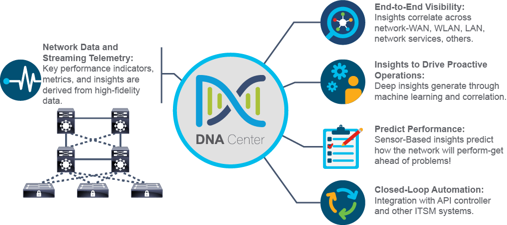
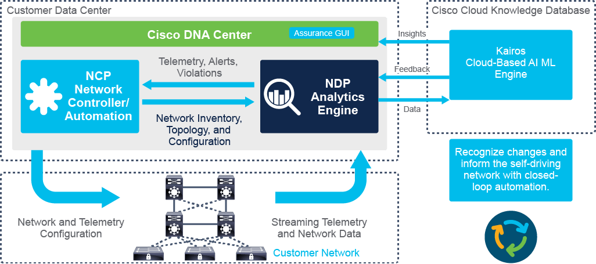
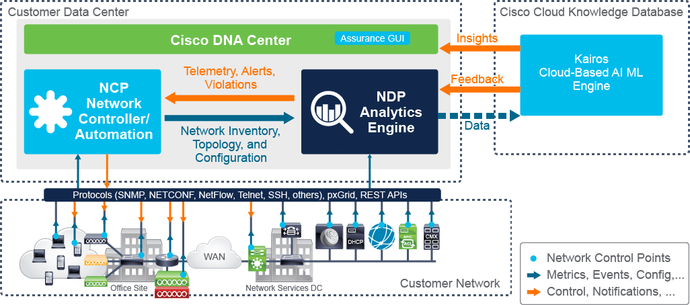

# Monitoring Health and Performance with Cisco DNA Center Assurance

[TOC]

## Introduction - Learning goals

You will explore how to use Cisco DNA Center Assurance features to monitor the following:

- The **overall health** of the network and network devices, their Key Performance Indicators (**KPIs**), and **potential issues.**
- The **health of wired and wireless clients**, **onboarding** steps, potential **issues**.
- The **performance** of networked **applications**.

You will learn **how applications are recognized and classified** on the network and how to use Cisco DNA Assurance features to **monitor** and **trend** the **health and performance of applications** and detect potential issues.

## Cisco DNA Center Assurance Functional Components

Assurance er ein kritisk del av DNA Center sin **"self-healing, closed-loop data arkitektur".** 

**Functional components** behøver ikkje vere noko ein kan velge i menyen til DNA Center, men **konsepter som gjer feilsøking raskare og effektiviserer nettverks-mgmt.** 

The key functional components are listed below, alle blir forklart nøyare seinare. 

* **Network data and streaming telemetry** - Obtain visibility, gain insight, predict perfomance and automate self-healing changes. DNA Center Assurance gather key perfomance metric and network data through traditional network mgmt methods and streaming telemetry. 
* **End-to-end Visibility** - Istadenfor å prøve å gjenkjenne problemer og feilsøke nettverket basert på usamanhengande information frå fleire devices,  ser DNA Center Assurance på nettverks-tasken ende-til-ende og "makes determinations of" akkuratt kva og kvar problemer er lokaliserte. 
* **Insights to drive proactive operations** - The Cisco Knowledge base and Machine Learning (ML) engine allow insights based on the way your network behaves, not just general networking experience. 
  This functionality allows predictions of future behavior to be calculated and to raise alerts when it deviates from a normal baseline. 
* **Predict perfomance** - sensor-based tests can monitor how the network will behave and correct situations before end-user impact. 
* **Closed-loop automation** - Closed-loop automation capability creates a process for creating a self-healing network.  Once realized (actually working..) DNA Center Assurance can detect issues and provide the details to the controller to automatically resolve them through integration with the API controller and ITSM (IT Service Management). 

### DNA Center Functional Architecture 

Figuren under viser DNAC Assurance functional architecture og back-end prosesser. 

DNAC står on-prem i DC, og samler Metrics, event og configuration frå nettverket.  
Den prosesserer og lagrer network data og streaming telemetry i "Network Data Plattform **(NDP) Analytics engine**".  

NDP består av: 

- A efficient, scalable **data collection and ingestion component** 
- Analytics Engine 
- Data Visualization component.  Som bruker APIs for Data retrieval and visualization. 
  - The Assurance UI is one such application within DNAC that uses API for data retrieval and Visz. 

Option to connect DNAC to cloud-based ML-Engine to establish baselines and construct predictive insights and feedback.  ML-Engine is called *Kairos*

The NDP forwards annonymisert telemetry from the network the cloud-based ML to determine what is "normal" for the network. 
Any deviations from the baseline will be forwarded to DNAC Automation Engine - Network Control Program (NCP) -.  NCP have the role of suggested remediation / Inten-based automation.  It will send commands to the devices to fix the situation. 
Telemetry is then used to determine if the issue was fixed. 

This creates a self-healing, closed-loop automation solution. 

**NDP = Network Data Platform** 
**NCP = Network Control Program**

### DNAC - Data Architecture 

Data arkitekturen for DNAC består av fleire "flow points" mellom Internal NCP, NDP, network devices og back-end components. 

DNAC kommuniserer med network devices, compute resources og eksterner applikasjoner gjennom: 

* Standard protokoller - telnet/ssh, snmp, netconf, netflow, https)
* Cisco Platform Exchange Grid (Cisco pxGrid)
* REST APIs

Devices inkluderer: 

* APs
* WLCs
* switcher
* routere

Compute resources and external apps include: 

* DNS / DHCP 
* Cisco ISE
* Cisco Connected Mobile Experience (Cisco CMX)
* Cisco DNA Spacec
* IPAM

I figuren over er compute resources og external apps markers som "Network control points".  
*Cisco DNA Center Release and Compatibility documentation* - Lister supporterte devices og sw-versions. 

Metrics, events og configurations are either pushed or pulled from these **Network control points** to the NCP og NDP. 
NDP kan optionally videresende anonymisert telemetri til Cloud ML.  ML-Engine kalkulerer baseline, predicts performance og ID anomalies. 
ML-Engine sender tilbake til DNAC gjennom Insights (til DNAC-GUI) og Feedback til NDP gjennom notifications. 

Basert på cloud-ML engine og ein on-prem **Machine Reasoning Engine**, vil NDP Analytics Engine prosessere dataane, og videresender telemetri, alerts og violations til NCP.  
NCP sender kommandoer til dei nødvendige devica for å fikse problemet.  NCP provides "Suggested remediaton and intent-based automation". 

## DNAC - Assurance Data Analytics and Metrics