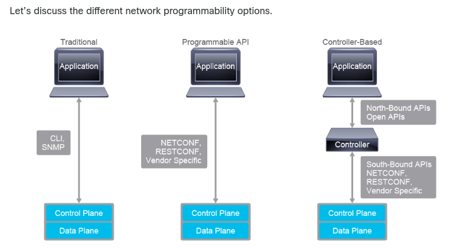
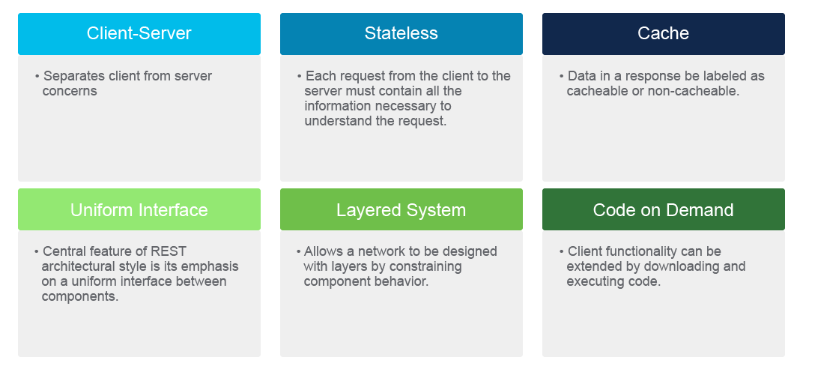
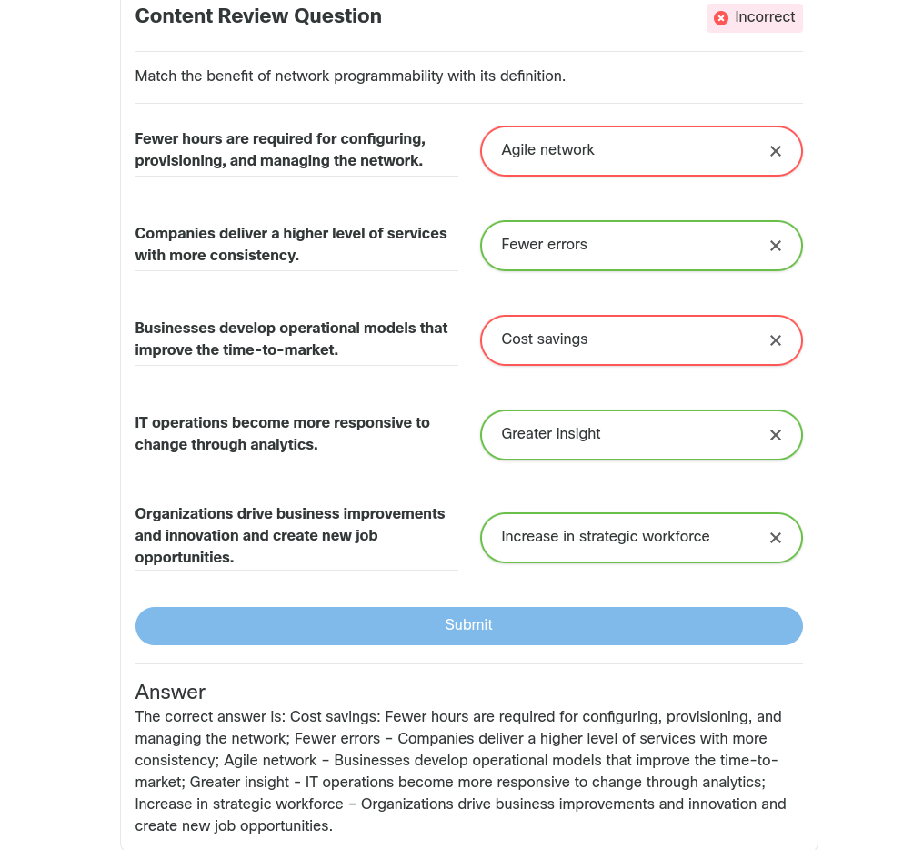

[TOC]

# 1. Intro to Python

## Introducing Programming and Python for Network Engineers

### Intro

### Programmability

Traditonal methods of device configuration include 

* Connect with console/telnet/ssh
* Configure device
* copy config to notepad
* search config for variables that need changing
* Connect to device and copy edited config back to device. 

*Network Programmability* refers to a "Set of tools for Deploying, Managing and troubleshooting network devices".  Benefits are: 

* Saving time and money
* Reduce human error
* Increasing innovation through an agile network
* Increasing network insight and control
* Increasing the strategic workforce

**Automation** - Accomplish repeatable tasks without human interventaion. 

**Orchestration**  - Combining a series of tasks to accomplish a process or workflow. 

#### API

An API is a software intermediary that allows two appilcatioans to talk to each other and is characerized as follows: 

* Separates functionality into building blocks
* Provides faster prototyping
* Specifies how informations is exhanged
* Provides Documentation

Types of API are: 

* RPC (earliest)
* XML-RPC
* JSON-RPC
* SOAP
* REST

#### REST

REST is not a protocol but more of an architectural style. REST have six constraints, listed in picture below. 

Three main components of REST are: 

* Client (application)
* Endpoint (DNA-center, Network device, Cisco SD-WAN etc)
* Resource (Data you want)

##### Methods

The four main methods in a REST-API are: 

* GET (Read)
* PUT (Create, Idempotent)
* POST (Update, Not Idempotent)
* DELETE (deletes, Not Idempotent)

> [!NOTE]
>
> Idempotence is *any function that can be executed several times* without changing the final result beyond its first iteration.  
>
> PUT will completely replace a resource
>
> POST will create a new resource. 

#### Review Questions and stupid definitions to remember

### Continued Importance of the CLI

### Need for Python

### First Python Program

### Execute your first Python Program

### Summary

## Scripting with Python, PIP, and Getting help

# 2. Data Types

# 3. Conditional and Loops

# 4. Reading and Writing Data to a File

# 5. Regular Expressions

# 6. Code Reuse

# 7. User Input

# 8. Troubleshooting