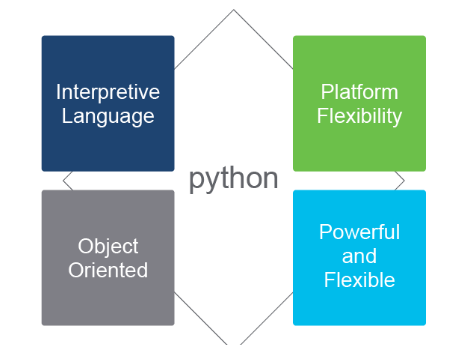
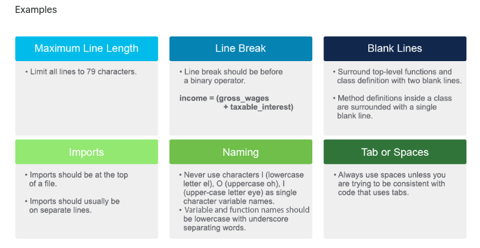
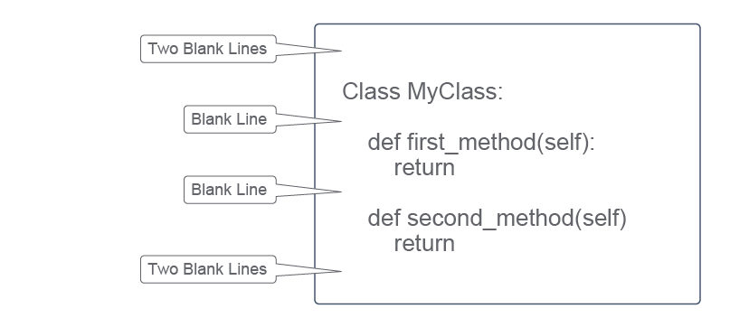

[TOC]


# 1. Intro to Python

## Introducing Programming and Python for Network Engineers

### Intro

### Programmability

Traditonal methods of device configuration include 

* Connect with console/telnet/ssh
* Configure device
* copy config to notepad
* search config for variables that need changing
* Connect to device and copy edited config back to device. 

*Network Programmability* refers to a "Set of tools for Deploying, Managing and troubleshooting network devices".  Benefits are: 

* Saving time and money
* Reduce human error
* Increasing innovation through an agile network
* Increasing network insight and control
* Increasing the strategic workforce

**Automation** - Accomplish repeatable tasks without human interventaion. 

**Orchestration**  - Combining a series of tasks to accomplish a process or workflow. 


#### API

An API is a software intermediary that allows two appilcatioans to talk to each other and is characerized as follows: 

* Separates functionality into building blocks
* Provides faster prototyping
* Specifies how informations is exhanged
* Provides Documentation

Types of API are: 

* RPC (earliest)
* XML-RPC
* JSON-RPC
* SOAP
* REST

#### REST

REST is not a protocol but more of an architectural style. REST have six constraints, listed in picture below. 


Three main components of REST are: 

* Client (application)
* Endpoint (DNA-center, Network device, Cisco SD-WAN etc)
* Resource (Data you want)

##### Methods

The four main methods in a REST-API are: 

* GET (Read)
* PUT (Create, Idempotent)
* POST (Update, Not Idempotent)
* DELETE (deletes, Not Idempotent)

> [!NOTE]
>
> Idempotence is *any function that can be executed several times* without changing the final result beyond its first iteration.  
>
> PUT will completely replace a resource
>
> POST will create a new resource. 

#### Review Questions and stupid definitions to remember


### Continued Importance of the CLI

Future needs for the CLI wll still be there, such as: 

* Alternative way to interact with devices
* Advanced troubleshooting
* Working with old devices
* Working with tools that can't use a devices API. 

### Need for Python

> [!NOTE]
>
> Python definition
>
> Python is an *Object oriented*, *high-level* programming language *primarily for web and app development*



**Interpretive Language**

Interpretive means "It executes line by line".  Becomes easier to test and debug because you don't have to compile. 

**Platform Flexibility**

Can run on Windows, Linux, Mac OS. 

In Servers, VM, Containers, cloud  and Cisco Devices. 

**Object Oriented**

Object-Oriented is a programming structuring method that *bundles related properties and behavior into individual objects*

Makes programs easier to maintain and improving software dev productivity. 

**Powerful and Flexible**

* Open-Source license
* Large community
* Large ecosystem saves time, don't have to build from scratch. 
* Broades community today for network programmability 
* PyPi / Github / Cisco DevNet code Exch
* PEP is design documents
  * PEP 8 = Style guide for Python code
  * PEP 20 = The Zen for python. 

### First Python Program

Example of a python program, it has three stages: 

* Import library (netmiko in this example)
* Define variables
* Run Netmiko commands and print output. 

```python
# Import library
import netmiko

# Define variable
ip = "10.254.0.1"
username = "cisco"
password = "cisco"
device_type = "cisco_ios"
port = "22"

# netmiko code to create a SSH-connection. 
net_connect = netmiko.ConnectHandler(
	ip = ip,
    device_type = device_type,
    username = username,
    password = password
    port = port
)

# Run "show version" command and print the output.
show_version = net_connect.send_command('show version')
print show_verison
```


### Execute your first Python Program

Just a lab executing the script from above. 

### Summary

Nothing interesting here. 

## Scripting with Python, PIP, and Getting help

### Intro, goals
Able to: 
* Describe the four option to run a python script, and identify when to use them. 
* Describe Python Enhancement Proposals (PEP)
* How PEP8 helps in writing better code
* Use the *help()* and *dir()* functions to get information about a Class, Method or function. 

### Running a python script

Python is a interpreted language since it does not requre compilation.  This is only half-true as it is also a compiled language. 

C/C++ are traditional compiled languages, when they compile code is translated to machine-code and creates a executable you can run. 

Python is translated to bytecode, that is run in a Virtual Machine. Bytecode is a low-level set of instructions that an interpreted can execute.  Running bytecode in a VM allows python to be platform independent. 

There are four different ways to run Python code. 

* **interactive shell** - Execute commands line by line. 
* **Terminal** - Windows and Linux terminals can execute python code.
* **IDE/Editor** - The integrated execution in your IDE/Editor such as vs-code can execute scripts. 
* **File manager of your system* - execute scripts by double-clicking in a file manager. 

### Python Interactive Shell 

Python is interpreted languange, it executes code line by line. 

The shell is also knows as **REPL**, it represents the process the interpreter uses. 

* **R** - Read user input
* **E** - Evaluate the code
* **P** - Prints (displays) the output to the user
* **L** - Loop back to step *Read*

### Editors and IDEs

**Code Editors** - Simple text editor with: 

* Syntax highlighting
* Code formatting
* some debugging capabilities

Commond Code editors are Sublime, Atom, VS-Code, Notepad++, Vim

**IDE** - Software for building applications combining commond dev tools into a single GUI. 

Common IDEs are: 

* IDLE - Pythons integrated Development and Learning Environment.  Included with python on windows, extra install on LInux.  Allows to execute a single command like in the shell, or create and executre python scripts. 
* Visual Studio - Only works on Mac OS and Windows. 
* PyCharm 
* Spyder. 

Core features needed in a coding environemnt are: 

* Syntax highlighting 
* Automatic code formatting 
* Save and reload code files. 
* Run code from within the environment 
* Debugging support

### Whitespace and PEP 8

Python Enhancement Proposal (PEP) is a document describing a new feature for Python, its processes or its environment.  It is the primary mechanism for proposing significant new features, collecting community input on issues, and documenting the design decisions going into Python. 

They are similar to RFCs. 

* Authored by groups or individuals within the community. 
* Documents that describe changes, features, processes, or behaviors

Primary audience for PEPs are core devs of the Cpython reference interpreter. Their elected steering council and devs of other implementations of the python language. 

Three categories of PEPs

**Standards Track** - Describe a new feature or implemenation for python. 

**Informational PEP** - Describes a python Design issue or provides general guidelines or information to the python community. 

**Process PEP** - Describes a process sourrounding python or proposes a change to a process. Examples are: 

* Procedures
* Guidlines
* Changes to decision-makin gprocess
* Changes to the tools or environment used in python development. 

The two most common PEPs. 

#### PEP 8 - Style Guide for Python

PEP 8 is a style guide, contains guidelines and best practice for writing python code. Intented to improve readability and make it consistent across the wide spectrum of python code.  

Covers topics as: 

* Code layout 
* Whitespaces
* Comments
* Naming conventions

Examples of guidelines. 



- **Maximum Line Length:** Limit all lines to a maximum of 79 characters.
- **Line Break:** Place line breaks before a binary operator. For decades, the recommended style was for a line break to be after the operator, but this was modified for readability purposes.
- **Blank Lines:** Surround top-level function and class definitions with two blank lines. A single blank line surrounds method definitions inside a class.
- **Imports:** List imports at the top of a file, with each import on a separate line.
- **Naming:** Write variable and function names in lowercase, with an underscore separating each word. In some fonts, characters are indistinguishable from the numerals one and zero. Never use the following characters as single-character variable names:
  - 'l' (lowercase letter *el*)
  - 'O' (uppercase letter *oh*)
  - 'I' (uppercase letter *eye*)
- **Tab or Spaces:** Use spaces. Only use tabs when you are trying to be consistent with prewritten code. Python 3 does not allow you to mix tabs and spaces.

#### PEP 8: Whitespace

Whitespace makes python code more readable. 

Python uses indentation to denote blocks of code.  Indentation should be indicated with four consecutive space, not tab. 

whitespace should sorround the following binary operators: **assignment comparisons** and **booleans**.

When to use blank lines: 



- Surround top-level functions and classes with two blank lines.
- Surround method definitions inside classes with a single blank line.
- Use blank lines sparingly inside functions to show clear steps.

When **NOT** to use blank lines: 

- At the end of a line
- Immediately inside parentheses, brackets, or braces
- Before a comma, semicolon, or colon
- Between a trailing comma and a closing parenthesis

#### PEP8: Checking code for conformity

*pycodestyle* is the official linter tool to check code against PEP8. 

`pip install pycodestyle`

```shell
$ pycodestyle my_script.py
warning.warn(
pep8check.py:4:2: E225 missing whitespace around operator
pep8check.py:8:3: E112 expected an indented block
)
```

[https://pypi.org/project/pycodestyle/.](https://pypi.org/project/pycodestyle/)

### Help

Two functions can help find which methods are available for a data type. 

**dir()** - Returns a list of attributes along with any available methods, the method description, and syntax. 

**help()** - Displays documentation of data types, functions, classes and so on. 

How to use **help()**

* Pass the **help()** function an arguments.  `help(str)`  
* Don't pass an argument.  This starts pythons help utility. 

### Summary

Nothing interesting in summary. 

# 2. Data Types

# 3. Conditional and Loops

# 4. Reading and Writing Data to a File

# 5. Regular Expressions

# 6. Code Reuse

# 7. User Input

# 8. Troubleshooting