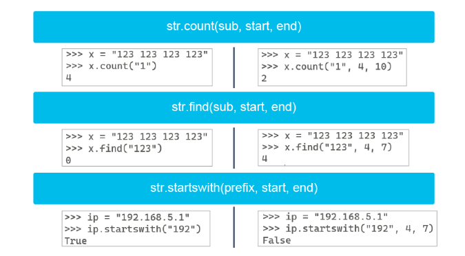
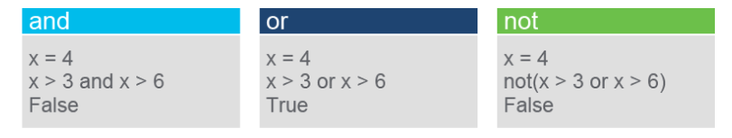

[TOC]


# 1. Intro to Python

## Introducing Programming and Python for Network Engineers

### Intro

### Programmability

Traditonal methods of device configuration include 

* Connect with console/telnet/ssh
* Configure device
* copy config to notepad
* search config for variables that need changing
* Connect to device and copy edited config back to device. 

*Network Programmability* refers to a "Set of tools for Deploying, Managing and troubleshooting network devices".  Benefits are: 

* Saving time and money
* Reduce human error
* Increasing innovation through an agile network
* Increasing network insight and control
* Increasing the strategic workforce

**Automation** - Accomplish repeatable tasks without human interventaion. 

**Orchestration**  - Combining a series of tasks to accomplish a process or workflow. 


#### API

An API is a software intermediary that allows two appilcatioans to talk to each other and is characerized as follows: 

* Separates functionality into building blocks
* Provides faster prototyping
* Specifies how informations is exhanged
* Provides Documentation

Types of API are: 

* RPC (earliest)
* XML-RPC
* JSON-RPC
* SOAP
* REST

#### REST

REST is not a protocol but more of an architectural style. REST have six constraints, listed in picture below. 


Three main components of REST are: 

* Client (application)
* Endpoint (DNA-center, Network device, Cisco SD-WAN etc)
* Resource (Data you want)

##### Methods

The four main methods in a REST-API are: 

* GET (Read)
* PUT (Create, Idempotent)
* POST (Update, Not Idempotent)
* DELETE (deletes, Not Idempotent)

> [!NOTE]
>
> Idempotence is *any function that can be executed several times* without changing the final result beyond its first iteration.  
>
> PUT will completely replace a resource
>
> POST will create a new resource. 

#### Review Questions and stupid definitions to remember


### Continued Importance of the CLI

Future needs for the CLI wll still be there, such as: 

* Alternative way to interact with devices
* Advanced troubleshooting
* Working with old devices
* Working with tools that can't use a devices API. 

### Need for Python

> [!NOTE]
>
> Python definition
>
> Python is an *Object oriented*, *high-level* programming language *primarily for web and app development*


**Interpretive Language**

Interpretive means "It executes line by line".  Becomes easier to test and debug because you don't have to compile. 

**Platform Flexibility**

Can run on Windows, Linux, Mac OS. 

In Servers, VM, Containers, cloud  and Cisco Devices. 

**Object Oriented**

Object-Oriented is a programming structuring method that *bundles related properties and behavior into individual objects*

Makes programs easier to maintain and improving software dev productivity. 

**Powerful and Flexible**

* Open-Source license
* Large community
* Large ecosystem saves time, don't have to build from scratch. 
* Broades community today for network programmability 
* PyPi / Github / Cisco DevNet code Exch
* PEP is design documents
  * PEP 8 = Style guide for Python code
  * PEP 20 = The Zen for python. 

### First Python Program

Example of a python program, it has three stages: 

* Import library (netmiko in this example)
* Define variables
* Run Netmiko commands and print output. 

```python
# Import library
import netmiko

# Define variable
ip = "10.254.0.1"
username = "cisco"
password = "cisco"
device_type = "cisco_ios"
port = "22"

# netmiko code to create a SSH-connection. 
net_connect = netmiko.ConnectHandler(
	ip = ip,
    device_type = device_type,
    username = username,
    password = password
    port = port
)

# Run "show version" command and print the output.
show_version = net_connect.send_command('show version')
print show_verison
```


### Execute your first Python Program

Just a lab executing the script from above. 

### Summary

Nothing interesting here. 

## Scripting with Python, PIP, and Getting help

### Intro, goals
Able to: 
* Describe the four option to run a python script, and identify when to use them. 
* Describe Python Enhancement Proposals (PEP)
* How PEP8 helps in writing better code
* Use the *help()* and *dir()* functions to get information about a Class, Method or function. 

### Running a python script

Python is a interpreted language since it does not requre compilation.  This is only half-true as it is also a compiled language. 

C/C++ are traditional compiled languages, when they compile code is translated to machine-code and creates a executable you can run. 

Python is translated to bytecode, that is run in a Virtual Machine. Bytecode is a low-level set of instructions that an interpreted can execute.  Running bytecode in a VM allows python to be platform independent. 

There are four different ways to run Python code. 

* **interactive shell** - Execute commands line by line. 
* **Terminal** - Windows and Linux terminals can execute python code.
* **IDE/Editor** - The integrated execution in your IDE/Editor such as vs-code can execute scripts. 
* **File manager of your system* - execute scripts by double-clicking in a file manager. 

### Python Interactive Shell 

Python is interpreted languange, it executes code line by line. 

The shell is also knows as **REPL**, it represents the process the interpreter uses. 

* **R** - Read user input
* **E** - Evaluate the code
* **P** - Prints (displays) the output to the user
* **L** - Loop back to step *Read*

### Editors and IDEs

**Code Editors** - Simple text editor with: 

* Syntax highlighting
* Code formatting
* some debugging capabilities

Commond Code editors are Sublime, Atom, VS-Code, Notepad++, Vim

**IDE** - Software for building applications combining commond dev tools into a single GUI. 

Common IDEs are: 

* IDLE - Pythons integrated Development and Learning Environment.  Included with python on windows, extra install on LInux.  Allows to execute a single command like in the shell, or create and executre python scripts. 
* Visual Studio - Only works on Mac OS and Windows. 
* PyCharm 
* Spyder. 

Core features needed in a coding environemnt are: 

* Syntax highlighting 
* Automatic code formatting 
* Save and reload code files. 
* Run code from within the environment 
* Debugging support

### Whitespace and PEP 8

Python Enhancement Proposal (PEP) is a document describing a new feature for Python, its processes or its environment.  It is the primary mechanism for proposing significant new features, collecting community input on issues, and documenting the design decisions going into Python. 

They are similar to RFCs. 

* Authored by groups or individuals within the community. 
* Documents that describe changes, features, processes, or behaviors

Primary audience for PEPs are core devs of the Cpython reference interpreter. Their elected steering council and devs of other implementations of the python language. 

Three categories of PEPs

**Standards Track** - Describe a new feature or implemenation for python. 

**Informational PEP** - Describes a python Design issue or provides general guidelines or information to the python community. 

**Process PEP** - Describes a process sourrounding python or proposes a change to a process. Examples are: 

* Procedures
* Guidlines
* Changes to decision-makin gprocess
* Changes to the tools or environment used in python development. 

The two most common PEPs. 

#### PEP 8 - Style Guide for Python

PEP 8 is a style guide, contains guidelines and best practice for writing python code. Intented to improve readability and make it consistent across the wide spectrum of python code.  

Covers topics as: 

* Code layout 
* Whitespaces
* Comments
* Naming conventions

Examples of guidelines. 


- **Maximum Line Length:** Limit all lines to a maximum of 79 characters.
- **Line Break:** Place line breaks before a binary operator. For decades, the recommended style was for a line break to be after the operator, but this was modified for readability purposes.
- **Blank Lines:** Surround top-level function and class definitions with two blank lines. A single blank line surrounds method definitions inside a class.
- **Imports:** List imports at the top of a file, with each import on a separate line.
- **Naming:** Write variable and function names in lowercase, with an underscore separating each word. In some fonts, characters are indistinguishable from the numerals one and zero. Never use the following characters as single-character variable names:
  - 'l' (lowercase letter *el*)
  - 'O' (uppercase letter *oh*)
  - 'I' (uppercase letter *eye*)
- **Tab or Spaces:** Use spaces. Only use tabs when you are trying to be consistent with prewritten code. Python 3 does not allow you to mix tabs and spaces.

#### PEP 8: Whitespace

Whitespace makes python code more readable. 

Python uses indentation to denote blocks of code.  Indentation should be indicated with four consecutive space, not tab. 

whitespace should sorround the following binary operators: **assignment comparisons** and **booleans**.

When to use blank lines: 


- Surround top-level functions and classes with two blank lines.
- Surround method definitions inside classes with a single blank line.
- Use blank lines sparingly inside functions to show clear steps.

When **NOT** to use blank lines: 

- At the end of a line
- Immediately inside parentheses, brackets, or braces
- Before a comma, semicolon, or colon
- Between a trailing comma and a closing parenthesis

#### PEP8: Checking code for conformity

*pycodestyle* is the official linter tool to check code against PEP8. 

`pip install pycodestyle`

```shell
$ pycodestyle my_script.py
warning.warn(
pep8check.py:4:2: E225 missing whitespace around operator
pep8check.py:8:3: E112 expected an indented block
)
```

[https://pypi.org/project/pycodestyle/.](https://pypi.org/project/pycodestyle/)

### Help

Two functions can help find which methods are available for a data type. 

**dir()** - Returns a list of attributes along with any available methods, the method description, and syntax. 

**help()** - Displays documentation of data types, functions, classes and so on. 

How to use **help()**

* Pass the **help()** function an arguments.  `help(str)`  
* Don't pass an argument.  This starts pythons help utility. 

### Summary

Nothing interesting in summary. 

# 2. Data Types

## Pre-Assesment 

8 av 9. 

## Examini Basic Data types: Strings, Integers, Floats and Booleans. 

Pre-assesment marks as proficient. 

## Examining lists, Tuples, sets, and dictionary types

Pre-assesment marks as proficient

## Manipulating strings

### Intro - goals

Have a good understanding of how to manipulate strings by 

* Removing white spaces from a string, 
* Retrieving specific information from a string 
* Concatenating strings 
* Replacing variables in a string. 

### String manipulation

Strings are immutable. Meanins that modifying a string creates a new object and does not change the original object. 

Some methods to manipulate strings are: 

* **capitalize()** - Returns a *copy* of the original string and Converts the first character to uppercase, making all other characters lowercase. If first chacter is a number, no letters are capitalized. 
* **title()** - Returns a *new string*. First character in each word is uppercase, remaining characters to lowercase. If first character is a number, the next letter will be uppercase. 
* **upper()** - Converts string to uppercase and returns the string. 
* **lower()** - Converts string to lowercase and returns the string. 
* **swapcase** - Returns the string, uppercase to lowercase og motsatt. 

### String splitting

`str.split(separator, maxsplit)`

**separator** - Split at this separator, default is any whitespace. 

**maxsplit** - Parameter times string will be split. Default is not limit. 

**returns** - A list of strings. 

### Modifying strings

**Slice indexing** - Grabs specific characters and returns them. 

**Slice** `str[index]` 

**range slice** `str[beginning index, ending index,step]`

```python
str = "Hallo"
str[1]
# Returns "a"
str[0:2]
# Retruns "Hal"
str[-3]
# Returns "l", third character counting from the end. Start at 1 when at the end. 
str[0:3:2]
# Returns "H","l".  Index 0 tom 3, annakvar index i rangen returnerast. 
```


### String concatenation

Process of joining two or more strings.  If joining variables the object must be of type str. 

Uses the "+" sign.  

Returns a new object. 

### Whitespace stripping

`str.strip()` - Removes whitespace from beginning and end of string. 

`str.lstrip()` - Removes whitespace from beginning of string. 

`str.rstrip()` - Removes whitespace from end of string. 

All methods return a new string-object, since strings are immutable. 

### Formatting and templating

#### .format() method

Adding a variable into a string.  String formatting creates a new formatted string. 

Handled by the **.format()** method.  Introduced in Python3. 

```python
x = "router1"
model = "3800"
os ="IOS-XE"
"The model of {0} is {1} with os {2}".format(x, model, os)
# Returns: 
'The model of router1 is 3800 with os IOS-XE'
```

{0}, {1}, {2} are placeholders for variables, and are referencing index locations in the string. 

At the end of the string in the format method, the variables **x**, **model**,**os** are located at indices 0,1,2

The placeholders support formating. 

```python
d = "router1"
ip = "192.168.5.1"
mask = "255.255.255.0"

>>> "{0:^20s}|{1:^20s}|{2:^20s}".format(d, ip, mask)
# Returns. 
'      router1      '|     192.168.5.1     |     255.255.255.0     |
```

`"{0:^20s}| {1:^20s}| {2:^20s}".format(d, ip, mask)`

**0** - Index number

**:** - seperator between index-number and formatting. 

**^** - Formatting, this indicates the data should be centered. 

**20** - Set the width of the column. 

**2** - States that the data is a string. 

Other formatting options are: 

* **<** and **>** - For left and right aligned. 
* **d** - For decimal instead of string. 

#### F-Strings

Introduced in Python3.6. 

Also called String-Literals. 

Are more readable and less error-prone way to format strings.  Less verbose and easier to use. 

```python
x = "router1"
model = "3800"
os ="IOS-XE"
f"The model of {x} is {model} with os {os}"
#Returns: 
'The model of router1 is 3800 with os IOS-XE'
```

The string starts with a **f** and the variables use curly brackets. 

#### Templates

Templates gives a customizable interface for string substituion.  Not used as often as .format() or F-strings, templates have additional features. 

Templates can pass any object that can be converted into a string as a parameter.  The template-class will automatically convert the objects to a string before inserting them to into the string. 

```python
from string import template
x = Template("The model of $device is $model with os $os")
x.substitute(device= "router1", model= "3800", os= "IOS-XE")
```

Require first importing of **Template** from the **string** module. 

Line 2 instansiates a Template using a string as an argument. 

The string have placeholders, the **$** indicate where a substition should happen, and the **device,model,os** map the placeholders to the objects to be inserted. 

The substitue() method maps the objects that need to be inserted into the placeholders. 

> [!NOTE]
>
> Det her ser ut som ein tungvindt version av .format(),  er enten heilt utdatert eller har ein usecase i litt meir kompliserte scenario som eksempelet ikkje får fram. Mulig det å kunne sende inn "any object that can be converted to string" er ein fin ting.  Enkelt å sende inn masse integers for eksempel. 

### escape characters

**\n** - Newline
**\t** - Tab
**\\** - Backslash
**\b** - Backspace
**\r** - CR (Carriage Return)
**\'** - Single Quote
**\"** - Double quote
**\000** - Octal value - `print ("\275")` `Returns ½`
**\xhh** - Hex value  - `print("\x48\x65\x6c\x6c\x6f")` `Returns: "Hello"`


Strings bruker enten single (') eller dobbel (")  quotes.  Quotes inside of quotes are called **Nested quotes**

Single quote inside a string require double quote on the outside. 

`"This is Bill's router."`

Alternate way is to escape the sincle quote inside: 

```python
'This is Bill\'s router.'
```

### String methods

* str.count(sub, start, end)
* str.find(sub, start, end)
* str.startswith(prefix, start, end)



**count()** - Counts how many times a substring of characters appears in the original string.  Parameters are: 

* **sub** - sub-string of characters you want to find
* **start** - Index you want ot start counting (optional)
* **end** - Index you want to stop counting (optional)

**find()** - Finds a substring of characters and retuns the first index where the substring is seen.  Parameters: 

* **sub** - sub-string of characters you want to find
* **start** - Index you want ot start checking (optional)
* **end** - Index you want to stop checking (optional)

**startswith()** -  Takes a prefix of characters and returns **True** or **False** if the string starts with that prefix. 

* **prefix** - sub-string of characters. 
* **start** - Index you want ot start looking (optional)
* **end** - Index you want to stop looking (optional)

### Summary

Nothin important here. 

# 3. Conditional and Loops

## Intro and goals

Have a good understanding of python-

* conditionals
* operators
* how they are used in the if-else construct
* Control the overall flow of a python script using the above. 

## Conditionals

Control flow tools allow you to execute a line or multiple lines of code when specific criteria are met.

The first line i a control structure is an expression that evaluates a boolean **True** or **False**. 


### IF-Statement

Is the most basic type of control structure.  Evaluates a expression and executes the code if the expression is **True**

### Else and Elif


**Else** runs if the **IF** statement evaluates to False.  Elif are multiple IF's.  

If a conditional evaluates to **True** no other statements will be run.  It exits at True.  Else is run if no IF / Elif evaluates to True. 

## Operators

Operators are special symbols in Python that are used to perform operations on variables and values.  Also known as Operands. 

Operators are divided into the following groups: 

- Arithmetic
- Assignment
- Comparison
- Logical
- Identity
- Membership

### Arithmetic


* Addition (x+y)
  * Can add variable and numbers if the variable is an integer, float, or Boolean
* Subraction (x-y)
  * if the variable is an integer, float, or Boolean
* Muliplikasjon (x*y)
  * if the variable is an integer, float, or Boolean
* Division (X/Y)
  * if the variable is an integer, float, or Boolean
* Modulo (x % y)  (Gives remainder after dividing).  (Viser resten etter ein dele-operasjon, 3 / 3 = 1, resten = 0.  3%3 er då 0. 10%3=1 fordi 3*3=9 med 1 i rest)
* Exponentation (X ** Y)  ( X opphevd i Y)
  * if the variable is an integer, float, or Boolean
* Floor Division (X // Y)  (Ikkje hørt om før, heiltalsdivisjon iflg chat-gpt).  divisjonsoperasjon som avrundar svaret ned til nærmaste heiltal. 
  * returns the smallest possible integer
  * Negative numbers gives a curvball. `x=-11, Y=5  X // 5 = -3`  Fordi -11 delt på 5 = -2,2 og -3 er den neste lavaste integeren. **LAVASTE** ikkje **NÆRASTE**

### Assignment operators

Used to assign values to variables.  The most common is **"="**

There are also augmented operators. They perform some arithmetic operation on the left side variable and then reassign the result to the left-hand variable. 

Easy example: 

```python
x = 5
x = x + 10
#Returns 15
#Alternativt: 
x += 10
```


* Assignment `X = 5`
* Addition Assignment `x += 5`
* Subtraction Assignment `x -= 5`
* Multiplication Assignment `x *= 5`
* Division Assignment `x /= 5`
* Modulo Assignment `x %= 5`
* Floor Assignment `x //= 5`
* Exponentation Assignment `x **= 5`

### Comparison Operators

Used to compare values and return a Boolean **True** or **False**


* **Equal** - `==` Check if both operands are the same.  Eval to **True** if they are. **False** if not. 
* **Not equal** - `!=` checks if operand on the left and right sides are different. If they are, eval to **True**, if not  **False**
* **Greater than** - `>` Checks if Left operand is greater than Right operand. 
* **Less than** - `<` Checks if Left operand is less than Right operand
* **Greater than or equal to** - `>=` Cecks if left is equal to or greater than right side. 
* **Less than or equal to** - `<=` Checks if left is less than or equal to right side. 

### Logical operator

**and**, **or**, and **not**.  Return **True** or **False**



**and** - If both are the same.  `True and True = True, False and False = True`  `True and False = False`

**OR** - If one of them are True `True or True = False, False or False = False`  `True or False = True`

**not** - Returns opposite of the Boolean value. If evals to **True** returns **False**, og motsatt.  

### Identity operators

Identity operators check to see if two values are located in the same part of memory.


**IS** - Checks if two variables point to the same memory location. 

**IS NOT** - Checks if two variables are not located at the same memory location. 

### Membership operators

Check to see if a variable or value is found in a string, list, tuple, set, or dictionary.


**in** - Check if variable is found inside a string, list, tuple, set or dictionary. 

**not in** - check to see if variable is not found inside a string, list,tuple,set or dictionary. 

## For and While Loops

### Intro and goals

Have a good understanding of the two types of loops, **for** and **while**. How to write them, and when they should be used. 

Learn how to use if statements inside of loops, and how to use **break** and **continue** statements. 

### Loops

 Executing code multiple times is known as iteration. When iteration is implemented in code, it is known as a loop. 

Loops will execute while some condition is met.  For and While loops are two types of control structures determening when and how many times a code block is executed. 

#### For loops

Iterable objects in Python are objects that can return each meber one at a time.  This is: 

* Strings
* Lists
* Dictionaries
* Tuples 
* Sets

You can iterate over these objects and run code on each of the object members using a **for-loop**.

`for <var> in <iterable>`  or  `for kvar_bokstav in string`

#### While loops

iterates over a code block as long as the test expression is True. Use when you don't know how many times the code block should be executed. 

Often used when a user input can determine if or how many times the code will run. 

`ẁhile <expression>` eller 

```python
my_var = 1
while my_var < 10:
    print (my_var)
    my_var += 1
```

### Loops with Lists, Dicts and Ranges

#### Loop over lists

Loop over a list with a simple:  `for var in list:  print (var)`

#### Loop over dict

Dictionaries have methods that can be used to abstract the keys, values or KV-Pairs.  Since the keys and values are custom. 

* **keys()** - Get the keys from a dict.  It saves the dict keys in an iterable that can be used in a For-loop. 
  `for the_key in dict.keys(): print(the_key)`
* **values()** - Get the values from a dict.  Saves the value of each key in an iterable. 
  `for the_value in dict.values(): print (the_value)` 
* **items()** - Get the KV-Pairs from a dict. Saves the KV-Pairs in a tuple.  Tuple is the same as list, but can not be changed (immutable)
  `for the_kv-pair in dict.items(): print (the_kv-pair)` 

#### Loop over ranges

The **range()** function allow you to generate a series of numbers within a given range. The range depends on how many arguements you pass it. 

`range(start, stop, step)`

**start** - number to start

**stop** - number to stop.  Stop number is not included in the count, if start = 1 and stop = 8, the range is 1-7. 

**step** - Difference between one number to the next. 

```python
for n in range(1, 4):
    print ("router" + str(n))
# Return:
router1
router2
router3
```

Also good to use with the **len()** function.  By using len() as the stop you always get the last item in the object. 

#### Loops with conditionals

If-statements inside a loop.  Just lots of text saying you can do a if inside a loop.. Shcoking! 

#### Break

Terminates the loop containing it.

Example below stops the loop at Router3.  It will print router1 and router2. 

```python
device = ["Router1", "Router2", "Router3", "Router4"]
for i in range(len(device)):
     if device[i]  == "Router3":  
          break  
     print(device[i])
```

#### Continue

Skips the rest of the code in the loop for just the current iteration.  It does not terminate the loop. 
example below will not print router3, but will print router1,router2 and router4

```python
device = ["Router1", "Router2", "Router3", "Router4"]
for i in range(len(device)):
     if device[i]  == "Router3":  
          break  
     print(device[i])
```


# 4. Reading and Writing Data to a File

## Reading and Writing Simple text and CSV Files

### Intro and goals

Have a good understanding of the format of a CSV file, how to use Python to open a simple text or CSV file, and the methods to read and write data to these files.

### CSV Data format

Never been any formal documenation for how to format csv-files. 

Can use comma, semicolon, tabs, and can be sorrounded by double quotes. 

- aaa,bbb,ccc
- "aaa","bbb","ccc"
- aaa;bbb;ccc
- aaa bbb ccc

Often used to exchange data between applications. 

### Reading data from simple text and CSV. 

Two steps.  Opening the file, and choosing the read-method. 

Eksempel fil to read, router.txt. 

```
Router1 is located in Bergen
Router2 is located in Oslo
Router3 is located in Trondheim
```


Ways of opening the file is: 

* Open(filename, mode)
* with open("filename", mode) as f:
  * filename = File to open. 
  * modes:
    * **r** - read-only, return error if file does not exist. 
    * **a** - Append, creates file if file does not exist.  If exists appends to end of file.
    * **w** - write, creates the file if it does not exist. If it exists overwrite contents. 
    * **x** - Create, creates the file, return error if the file exists. 
  * F - the variable the file object til will be reffered to as. 

`with open` is easier to use. It closes the file for you when you are done.  This prevents the file from being left open, and preventing others from using it. 

```python
with open("router.txt", "r") as f:
    content = f.read()
    print(content)
```

There are three methods of reading the files. 

* read()
  * Retuns the contents of the file as individual **strings**, makes it easy to manipulate the data. 
  * With no parameters specified the complete file is read. 
  * To only read parts of the file, specify the number of bytes to return with  `read(n)` 
* readline()
  * Returns each line one at a time.  Above example would return only first line.  As string I think, like read(). 
  * Also returns n bytes with read(n)
* readlines()
  * Returns a **list** of all lines. 
  * Can control the output by using Slicing.  `print(f.readlines()[1:2])`  List slicing here return index 1:2.  

#### Read CSV files

Use the built-in library called **csv**.  

```python
with open('device.csv', 'r') as f:
    devices = csv.reader(r)
    header = next(devices)
    print(f'Headers: {header}')  #F-string
    for row in devices:
        print(row)
```

**csv.reader()** - iterates over the file and returns the data line by line

**next()** - calls the `devices._next_()` method under the hood and moves the iterator to the next line and waits for a command. This reads the first line in the CSV-file (containing headers), and stores it in the header variable. 

**csv.DictReader()** - Alternative to reader().  Also iterates over the file, but saves each rowe to a dict with headers as the key. 

### Writing Data to a simple text and CSV file

#### Writing data to a simple text file. 

To write data to .txt file you have to determine if you are writing or appending to a file.  And wich write method to use, 

**file.write()**  - Writes the data to the file. 

**file.writelines()**  - write a list of data to a file

```python
# write() example
data = "switch1 is located in Bergen"

with open ("switch.txt", "w") as f:
    f.write(data)
    
# writelines() example
data = ["switch3 is located in Trondheim", "\n", "switch4 is located in Tromsø"]

with open ("switch.txt". "w") as f:
    f.writelines(data)
#result:
switch3 is located in Trondheim
switch4 is located in Tromsø
```

> [!TIP]
>
> You can also use the `print()` function to write data to a file using the keyword argument file. In many scenarios, `print()` is more powerful than `file.write()` because of the additional functionality built into `print()`
>
> The `print()` function enables you to use any character or characters that you want to separate the values you are printing with the keyword argument **sep**. The keyword argument **end** will add a newline character ("\n") by default after the last value you print, but you can change that too.
>
> To use `print()` to write to a file, use the command `print(data, file = newdevices.csv)`.
>
> Undersøke det her nærare. Var ikkje beskreve meir enn det her. 

When opening the file in **append** mode, the new data is added to the end of the last line in the file.  To fix this add a newline to the start of the data, or do a extra write operations first with a newline.  `\n` 

#### Writing data to a csv file 

Example, reads data from list *data* and writes it to csv-file *newdevices.csv*

```python
import csv

data = [['hostname', 'vendor', 'model', 'location'],
        ['sw10', 'cisco', '3800', 'bergen'],
        ['sw11', 'cisco', '8500', 'oslo']]

with open('newdevices.csv', 'w') as f:
    devices = csv.writer(f, quoting=csv.QUOTE_NONNUMERIC)
    for row in data:
        devices.writerow(row)
```

**csv.writer** - Takes user data and turns each row into a delimited string. 

**quoting** - Tells the writer what you want quoted.  **quoting_nonnumeric** means to put quots around everything except numeric values. 

### Traverse a file structure - lab

> [!TIP]
>
> A trailing comma is best practice for a multiline tuple, set, list, or dictionary. 
>
> Editing an existing sequence of one of these types, if you did not have a trailing comma after the last item, the changes to that line would appear in a git diff or other versioning tool, while the only change to the line was the addition of a comma.
>
> ```python
> #example: 
> 	new_list = [
> 	    'a',
> 	    'b'
> 	]
> # Adding C, result in git diff: 
> 	new_list = [
> 	    'a',
> 	-   'b'
> 	+  'b',
> 	+  'c',
> 	] 
> # with trailing coma: 
> 	new_list = [
> 	    'a',
> 	    'b',
> 	+  'c',
> 	] 
> ```

example from lab on traversing file structure: 

```python
import os

def main():
    print(os.getcwd())

if __name__ == '__main__':
    main()
```

> [!TIP]
>
> Using an underscore as a variable to represent values that, once used, are not important to the script anymore can help with readability. When you see an **underscore used as a variable name**, you know that data is not important in general or at that stage of computation.

Full lab example of python script with class to connect to cisco-devices, and write the data back to a file. 

```python
import netmiko
import os

# Class was pre-writen in lab. 
# import os, plus main-function and if __main__ was written in lab. 
class CiscoIOS():
    """
    This class is designed to connect to a cisco IOS appliance and get various data or 
    issue configuration commands
    """

    def __init__(self, ip, port=22, prompt=False, username=None, 
                        password=None, device_type='cisco_ios'):
        """
        Establishes connection to target device.
        
        :param str ip:              ip address of target device.
        :param int port:            port for connection
        :param str username:        username for authentication
        :param str password:        password for authentication
        :param str device_type:     should not change, class is designed for Cisco IOS
        """
        self.conn = netmiko.ConnectHandler(ip=ip, port=port, username=username,
                        password=password, device_type=device_type)
        _ = self.conn.send_command('sh run | include hostname')
        self.hostname = _.split()[-1]

    def get_run_cfg(self):
        """
        Returns the running-config from the appliance as a string
        """
        running_config = self.conn.send_command('sh run')
        return running_config

    def get_ip_int(self):
        """
        Returns the output from show ip interface as a string
        """
        ip_int = self.conn.send_command('sh ip int')
        return ip_int

    def get_log(self):
        """
        Returns the log from the appliance as a string
        """
        log = self.conn.send_command('sh log')
        return log

def main():
    #print(os.getcwd())
    ip_list = [
        '10.254.0.1',
        '10.254.0.2',
        '10.254.0.3',
    ]
    router_list = []
    for ip in ip_list: 
	    conn = CiscoIOS(ip, username='cisco', password='cisco') 
	    router_list.append(conn)
    for router in router_list:
        base_dir = os.getcwd() + '/routers/' 
        router_dir = base_dir + router.hostname + '/'
        os.mkdir(router_dir)
        data_dict = {
            'running-config': router.get_run_cfg(), 
            'ip-interface': router.get_ip_int(), 
            'log': router.get_log(), 
        }
        for output in data_dict:  
	        filename = router_dir + output + '.txt'
            with open(filename, 'w') as f: 
	            print(data_dict[output], file=f)

if __name__ == '__main__':
    main()
    for _ in os.walk('routers'): 
        print(_)
```

### Read, Store and Retrieve data in XML format

Use the **requests** module.  `import requests`

```python
# Quick notes from lab for handling XML: 
import requests
def get_interface_info(to_terminal=False)
    """ 
    THIS IS A DOCSTRING
    Returns interface information in XML format 
    If to_terminal=True prints data instead of returning
    """
	api_root = 'https://10.254.0.1:443/restconf' 
	dn = '/data/Cisco-IOS-XE-native:native/interface/'
    
    # Variable response, holds value of the requests response after making a get request. 
    response = requests.get(api_root + dn, 
    auth=('cisco', 'cisco'), 
    verify=False
	)
    # Print the response or return it based on to_terminal being True or False
    if to_terminal == True:
	    print(response.content.decode('utf-8'))  
	else:
    	return response.content

get_interface_info(to_terminal=True)

# Manipulate XML data
from bs4 import BeatuifulSoup

xml_data = get_interface_info()
soup = BeautifulSoup(xml_data, 'lxml')
soup.prettify()

# Access tags in the xml-data. 
print(soup.gigabitethernet).

# View all gigabitethernet instead of just the first: 
for intf in soup.find_all('gigabitethernet'): 
    print(intf) 
    print('-' * 50)
```

Line 29 - interpret the data in **xml_data** with **BeautifulSoup()** using the **lxml** XML parser. 

A parser breaks data down into smaller elements so that the data can be translated from one language to another. The **lxml** parser makes it so the **BeautifulSoup** class can use XML data.

The BeautifulSoup object **soup** has methods that help you work with XML data. 

In addition, the attributes of **soup** are the tags present in the XML data. To navigate the XML data with dot notation, you must target the first unique tag in the path to the data that you are targeting. 
Dot notation will return the contents of the first occurrence of the tag that you are searching for.

**find_all()** method to create a list of BeautifulSoup objects, each containing information pertaining to one interface

> [!NOTE]
>
> You cannot always use dot notation to find the data that you are looking for in an XML string using **BeautifulSoup()**. Sometimes, the name of a pre-existing method or attribute will conflict with the name of a tag. The **BeautifulSoup()** attribute **name** will always contain the name of the tag that you are viewing. In the XML interface data, **name** is also how you would distinguish the different GigabitEthernet interfaces. Instead, you can use the **find()** method, which will return a match, including the tags. Use the attribute **string** to find the data between the open and close tag.

Observe the contents of the tag **<ip>** in the following image. The tag **<address>** occurs two times in the path to the primary IP address of the interface.


When this is the case, dot notation or the **find()** method will each return the first tag that matches your search. GigabitEthernet 1 does not have an **<ip>** tag and will return **None** if you try to find it. You can return the result of **soup.find('ip')** to a variable, and use a conditional statement to do something if that tag is present.

## Reading and writing a JSON file

### Intro and goals

* Have a good understanding of the syntax of a JSON file 
* Use the JSON library to create a Python script that can read JSON file or data sent from a device, 
* Write JSON file or data to send to a device.

### Reading data from json text file

To read data from a JSON file, you use a built-in Python standard library named **json**. The **json** library allows you to encode and decode JSON data.

```python
import json
from pprint import pprint  #pretty print

with open ('csr_interface_IPsjson', 'r') as f:
    ip = json.load(f)
pprint(ip)
```

use the `json.load()` method to deserialize the JSON file and return a Python object:

The `json.load()` method translates JSON data to Python objects in the following way:

> [!IMPORTANT]
>
> Important table.  Good cheat sheet for å hugse korleis forskjellige data blir lagra og konvertert. 

| JSON   | Python      |
| ------ | ----------- |
| Object | Dictionary  |
| Array  | List, tuple |
| String | str         |
| number | Int, float  |
| true   | True        |
| false  | False       |
| null   | None        |

> [!NOTE]
>
> There is also a **json** method called `loads()`, with an “s” at the end of load. `json.loads()` does not decode a JSON file to a Python object like `json.load()`, but instead decodes a JSON string to a Python object.
>
> load() - load file
>
> loads() - load string. 

**pprint**  - prints data structures in a well-formatted way that is more readable than using the `print()` function. 

```python
pprint(object, indent=1, width=80, depth=None)
```

- **object:** Object to print.
- **indent:** Number of characters to indent each line.
- **width:** Maximum number of characters in each line.
- **depth:** controls how far down into the nested data pprint will look.

pprint must be imported from pprint module. 

### Writing data to a JSON text file. 

**json.dump() ** - will serialize the object that you want to write to a file into a json string and write the serialized data to the file that you specify
`json.dump(data, file, indent=None)`
Parameters are: 

* **data:** The python dictionary you are writing to a file.
* **file:** File object you want to write the data to.
* **indent:** The spacing for each level of indentation.

And more, for full list of parameters look at:  https://docs.python.org/3/library/json.html.

```python
import json

json_data = [ {key1:'value1', key2:'value2'}, {key1:'value3', key2:'value4'} ]
with open('newjsonfile.json', 'w') as f:
    json.dump(json_data, f, indent=2)

```

> [!NOTE]
>
> There is also a **json.dumps()** method.  This will take a Python dictionary and convert it into a JSON string. The result does not get written to a file but can be stored in a variable as a Python string.  The variable can be used anywhere in your program where it needs to be read or sent a JSON string. 
>
> It is very important to note that if you use json.dumps() to convert your dictionary to a json string, all dictionary keys will be of type “str.” Therefore, if you convert back to a dictionary, it might not equal the original dictionary.


> [!TIP]
>
> A pointer is an extra name that you can use to refer to an object that exists in memory.
>
> Because the list of dictionaries exists in memory, by simply assigning a variable, the value of that list will create a pointer. Using a pointer to manipulate data makes it easier to work with nested data or data within another object. When you finish your task, the modifications are present in the original object.
>
> ```python
> # Example from lab. interface_list access existing dict in lists. interface_list is a pointer to nested values. 
> interface_list = json_data['Cisco-IOS-XE-native:interface']['GigabitEthernet']
> ```

# 5. Regular Expressions

## Introducing regular expressions

### Regular Expressions

Marked as proficient..  Might want to read up on this later anyway though. 


There are **four** main parts to using regular expressions in your code. First, you must **import the re module**. The second step is to **write your regex pattern.** Writing your regex patterns is the most challenging part, but you will learn the metacharacters used in patterns to search your file or output. The third step is **accessing the data you want to search:** this could be a file you open or an output from a show command. The last part is **choosing the proper re function** to get the result you are looking for.

```python
import re
pattern = 'GigabitEthernet[1-4]'
data = 'interface gigabitethernet2 ip address 10.1.0.1 255.255.255.0'

result = re.search(pattern, data)  #search data using pattern. 
print (result)
```

> [!TIP]
>
> another popular approach to writing rex patterns is to use **raw strings**. Raw strings are literal **strings prefixed with "r"** and are often used when working with regular expressions and paths in file systems because they t**reat backslashes `(\)` as literal characters rather than escape characters.** This is useful because regex patterns and file paths often contain backslashes, which can cause unintended escape sequences in regular string literals.
>
> The pattern above can also be written `pattern = r'GigabitEthernet[1-4]` 

#### Metacharacters


When writing patterns to match a string, most characters will match exactly. For example, if you wanted to match 'Router1', you could search for 'Router1'. Writing patterns becomes more complicated when you need to match something less exact. 

You can use metacharacters when you can't write the exact match you want. Metacharacters do not match themselves; they alter the way the **re** module reads the pattern.

- **Square Brackets [ ]:** Match any character within the brackets.
  1. [abc] – Matches any character a, b, or c
  2. [a-z] – Matches any lowercase character a through z
  3. [a-zA-Z] – Matches any character lower or uppercase a through z
  4. [168] – Matches any digit 1, 6, or 8
  5. [0-9] – Matches any digit 0 through 9
  6. [1-9][0-9] – Matches any digit 10 through 99
  7. [^trs] – Does not match any of the characters that follow the caret inside the brackets
- **Period (.):** Matches any character besides a new line character.
  1. 'P..E' – Matches 'PRNE', 'PrnE', or 'PopE'
- **Caret (^):** Matches strings that start with the characters following the caret.
  1. '^PRNE' – String must start with 'PRNE'
- **Dollar sign ($):** Matches strings that end with the characters preceding the dollar sign.
  1. 'class$' – String must end with 'class'


- **Star (\*):** Matches zero or more occurrences of the specified value(s).
  1. [0-9]* – String can have 0 through 9 zero or more times. The string 'Router1' would match because of the ‘1’.
- **Plus (+):** Matches one or more occurrences of the given value(s).
  1. [a-zA-Z]+ – The string can have a lowercase or uppercase a through z one or more times. The string '192.168' would not find a match but 'PRNE' would match.
- **Question mark (?):** Matches zero or one occurrence of the given value(s).
  1. [1-9]? – This would match the string 'Router1' and 'Router'.
- **Curly brackets ({}):** Matches a specified number of occurrences of the value(s).
  1. [abc]{2} – The string must match two of the preceding characters. For example, the string 'ab567' would match because of the ‘ab’ and the string 'ca567' would match, but the string 'a567b' would not match because the two characters are not together.


- **Parenthesis ( ):** Used to group sub-patterns
  1. Switch(1|2|3)+ – Will match any string with the characters 'Switch' followed by 1 or more of the following digits 1, 2, or 3. The string 'Switch1' will match, the string 'Switch11' will match, and the string 'Switch1223' will match, but the string 'Switch4' will not.
- **Escape (\\):** Used to escape various characters, allowing them to be matched
  1. \$ – Matches the $ exactly so it is not used as a metacharacter.
  2. \. – Matches the . exactly so it is not used as a metacharacter.
  3. s - Matches any single whitespace. 
- **Vertical bar (|):** Used for either or
  1. AB|12 – For a string to match it can either have the characters AB or 12 in the string. So, the string 'SwitchAB' would match and the string 'Switch12' would match, but the string 'SwitchA' would not.

> [!TIP]
>
> As you work with regular expression, it is useful to have a place to test your patterns and make sure they are matching the correct data. This site helps you build and test your patterns: https://regexr.com/


* **search()** - Two parameters.  Returns first match. 
  * Regex pattern you want to match. 
  * Data you want to search. 
  * Returns: an object of the **first match**, or, if there is no match, it will return 'None'
    * The returned match-object:  `<re.match object; span=(2,4), match='c1'>` 
      The **span** indicates the **beginning and ending index** the match was found at and the **match shows the matching string.**
* **findall()** - returns all matches in a list.
  * Takes same parameters as search() 
* **split()** - splits the data any place there is a pattern match and returns a list of strings adjacent to the splits
  * takes same parameters as above. 

```python
# Examples: 
# Search(): 
data = 'abc123cba321'
pattern = '[abc][123]'
result = re.search(pattern, data)
<re.Match object; span=(2, 4), match='c1'>

# findall()
data = 'abc123cba321'
pattern = '[abc][123]'
result = re.findall(pattern, data)
['c1', 'a3']

# split()
data = 'abc123cba321'
pattern = '[abc][123]'
result = re.split(pattern, data)
['ab', '23cb', '21']
```


## Reading raw or Unstructured Data using Regular Expressions. 

There are a couple of ways that you can handle unstructured data. One is to use regular expressions to find the information you want and save it to a dictionary, and the other is to use TextFSM with Netmiko to have the data saved in a JSON format.

### Using regex 

> [!TIP]
>
> To take two lists and make a dictionary, use the function `zip` along with the function `dict()`.The `zip` function takes the two lists and returns a list of tuples, and the `dict()` function takes the list of tuples and returns a dictionary. The following command uses these two functions:
>
> `interface_dict = dict(zip(interface_names, interface_statuses))`

Nothing new in this module really..  Just screenshot code. 


#### Using TextFSM with Netmiko

An easier way to take an output from a command sent by Netmiko and turn it into a dictionary or list is to use TextFSM and ntc-templates.


To use TextFSM, all you need to do is download the templates from GitHub and use the following command:

```python
sh_ip_int_br = csr.send_command("show ip int brief", use_textfsm=True)
```

This command uses the netmiko method `send_command()` to send `show ip int brief` to the device. 

The parameter `use_textfsm=True` instructs Netmiko to **take the unstructured data that is being returned and format it in a list of dictionaries.**

The TextFSM module was developed by Google and uses templates to parse any text-based CLI output. TextFSM templates contain variables and rules with regular expressions. A template file defines how to parse the output into a structured format. You can build your own TextFSM templates, or you can find various templates on GitHub.

A TextFSM template has two parts—**Value and Start:**

- **Value:** Defines the fields that should be extracted. INTF, IPADDR, STATUS, and PROTO are variables that will be used in the regular expression. Following each variable is a description of what is the expected output for that variable.
- **Start:** Signifies the beginning of the template that defines the rules to parse the content. The rule is a regular expression using the previously mentioned variable. The term “record” at the end of the command means that each line that matches the regular expression will be processed.

# 6. Code Reuse

## Exploring functions, namespaces, scopes and the main construct

Marked as Proficient. 

Scope of a function: 

* **Local Scope**: Variables created inside a function. Only accessible inside the function. 
* **Global scope** - Variables defined outside any function.  Can be accessed from anywhere. 
* **Enclosing scope(nonlocal)** - When you have nested functions.  Variables in a outer function can be access by the inner function if using the **nonlocal** keyword. 

## Exploring Classes, Methods, and Inheritance 

### Intro and goals 

* Have a good understanding of how to build a class with attributes and methods, H
* How to make an instance of a class. 
* Have a good understanding of how to build classes that inherit attributes and methods from a parent class. 

### Classes and Methods

In object-oriented programming such as Python, everything you create is an object. An object can have attributes and methods that are linked to it. Objects are an instance of a class. You can think of a class as a blueprint.


**Objects** is an instance of a class. 

**Attributes** are variables that are shared between instances of a class; however, the values can differ from instance to instance

**Method** is similar to a function, but it is tied to an object. Methods allow similar tasks between instances


To create a class, Use the keyword **class** followed by the **<name of the class>** and a colon (**:**)

**def __init__(self, hostname, ip, device_type, username, password)** defines the init method.  

**init** method is a reserved method that is also known as a **constructor**. **Constructors are called when you want to create an object from the class.** A**rguments in the constructor are used as an object's variables**.

There are two types of variables in a class;

* **Class** variables - assigned like any other variable and never changes, no matter how many instances you make. 

* **Instance** Variables - Changes with each instance. Defined in the `__init__` variable. 

All attributes under the **__init__** method will be set when each instance is run. 

* The first argument in the **__init__** method is alway self.  
  * This keyword can be anything you want it to be, but self is recommended / best practice / sedvane. 
* **Self** represents the instance of a class and allows the class to keep the different instances and the arguments that go with them separate

```python
# Class variables: 
class Cisco:
	support = 'ciscosupport@cisco.com'  # Class variable. Never changes. 
    
	def __init__(self, hostname, ip, device_type, username, password): #Everything here is instance variables. 
        self.hostname = hostname 
		self.conn_data = { 
              'ip': ip, 
              'device_type': device_type, 
              'username': username, 
              'password': password  
             }
	def login(self):
      return netmiko.ConnectHandler(**self.conn_data)

# Using the class: 
router1 = Cisco('csr1kv1', '10.10.10.1', 'cisco_ios', 'cisco1', 'cisco_pw_1')
router2 = Cisco('csr1kv2', '10.10.10.2', 'cisco_ios', 'cisco2', 'cisco_pw_2')

router1_conn = router1.login()
router2_conn = router2.login()
```

### Using inheritance to extend functionality

Inheritance allows you to define a class that inherits all the methods and attributes from another class.  Inheritance is important because it allows for code reusability and it represents real-world relationships.

The class that is being inherited from is known as the **base class or parent class**. The class that inherits from another class is called the **derived class or child class.**

* Makes your code cleaner, 
* Allows for faster development.
* Children classes inherit defined methods and attributes from their parent class. 


The function **login()** is defined in the parent class **CiscoIOSBase**, so it is also a method of the **CiscoIOSRouter** child class.

```python
# Create a child-class from the parent-class shown in the picture above: 
class CiscoIOSRouter(CiscoIOSBase):
    pass
```

```python
# Example with inherited attributes and methods. 

class CiscoIOSRouter(CiscoIOSBase):
    """Functions specific to IOS routers"""
    
    def get_run(self):
        return self.conn.send_command('sh run') # self.conn is inherited, builds on it with send_command.
    def get_log(self):
        return self.conn.send_command('show log')

router1 = CiscoIOSRouter('10.10.1.1', username='cisco', passord='cisco') #init child-class, parameters from parent-class. 
router1.logn() #function from base-class
print(router1.get_log()) #function from child-class.
```

> [!NOTE]
>
> The Cisco() class is essentially a **wrapper** for the netmiko connection process. A wrapper is code whose **main purpose is to call another piece of code** to run. In this case, the wrapper is used to reduce the complexity of **netmiko.ConnectHandler()** through abstraction.

> [!TIP]
>
> The function **super()** enables you to call functions from a parent class (also called a superclass) in its child or sibling classes. This is useful when you want to change the way a function defined in the parent class behaves in a child class.
>
> ```python
> # In the CiscoIOSRouter child we can for example edit the __init__ function from the CiscoIOSBase parent. Adding device_type. 
> super().__init__(ip, device_type='cisco_ios',
>                 username='cisco', password='cisco')
> ```
>
> 


## Exploring Python Modules and Packages

Marked as Proficient. 

# 7. User Input

## Gathering and Validating user input

Marked as proficient

## Exploring inputs from the command line

### Intro and goals

* Have a good understanding of how to import the two Python modules used to read arguments from the command line 
* How each of these modules pass the arguments to your program. 

### Command-line arguments

Command-line arguments are passed to the Python program when it is called from the command line. 

```bash
C:\> python pythonprogram.py arg1 arg2 arg3
```

You use the **sys** and **argparse** modules to code this functionality. 


#### sys

The simplest way to handle arguments is with the **sys** module.

the **sys** module implements the arguments in a simple **list** structure named **sys.argv**

`print(f'Argument List: {sys.argv}')`  - This prints the sys.argv list as strings. The output is: 

```python
Argument List: ['PRNE_ARG.py', 'Test1', 'Test2', 'Test3']
```

The result shows that the list contains the **Python file name at index 0** and **then the arguments** follow.

To use one of these arguments in your code, you need to access it at its index number.   To retrieve the argument Test1 in the example, you would use the command `arg1 = sys.argv[1]`

While the **sys** module is easy to use, it does not help your users understand what arguments should be used. Any help or error checking will need to be coded by you.

#### argparse

Python has a module with functionality for the verification of required and optional arguments. This module also includes:

* help that can be accompanied by a default message
* a list of accepted arguments
* any information you would like to provide about those arguments to the user. 

```python
# argparse example
import argparse
text = "this program takes input for router information"
parser = argparse.ArgumentParser(description=text)
parser.add_argument("-R", "--router", help="Enter router name")
parser.add_argument("-IP", help="Enter ip address")

router = parser.parse_args()

print(f'The router name is {router.router} with ip address {router.ip}')
```

Once imported you need to: 

* Initialize the parser
* Add help statement
* Add required and optional arguments. 

**Line 3** of the script is assigning a help statement to a variable called text. This help statement can be used to help users understand basic information about the expected input.

**In line 4** you **create the parser and add the help statement.** The ArgumentParser will hold the information to parse the command-line arguments into data types

**Lines 5 and 6** add your **required** or **optional** arguments with the `add_argument()` method. 

Options available in **add_argument()** is: `parser.add_argument(short_option, long_option, help, action)`

* **Short option:** Short representation of the argument that follows.
* **Long option:** Long representation of the argument that follows.
* **Help:** Message that will be displayed to help the user understand the argument.
* **Action:** If action is set to "store_true," the argument is optional. Otherwise, it will be blank.

**line 8** `parser.parse_args()`, which holds the inputted arguments, is assigned to the variable **router** and used in a print statement. 

To use the arguments saved in router, you will **need to use the <variable_name>.<argument_option>.** Notice that to access the router name you would use router.router and to access the IP address you would use router.IP.

### Prompt the user for Input (LAB-module)

Lab-Module, only noting down tips and notes that are good to remember. 

> [!TIP]
>
> ### Use a  _  as Variable name
>
> The variable created on line 24 is named _ (a single underscore). In Python, the variable named as an underscore can be used to represent values that are not important to the script or will not be important after they are used. On line 24, the value of underscore is **"hostname [hostname-of-router]."**
>
> ```python
> _ = self.conn.send_command('show run | include hostname')  #returns hostname lab-ruter1
> self.hostname = _.split()[-1]  # ta _ variabelen og split den. Kun lagre "lab-ruter1" og forkast "hostname" kommandoen.
> ```
>
> You can also use the underscore as the variable in a "**for**" loop.
>
> ```python
> for _ in range(10):
>     print(_)
> ```
>
> If you typed the code `x, y, z = [1, 2, 3]`, the value of x **will be 1, y will be 2, z will be 3.** If you use the **underscore** as one of the variable names in a scenario like this, you are logically excluding values from a sequence. 
>
> Here The subnet mask would still be stored in the underscore, but you can see that it is not important or will not be used in the script.
>
> ```python
> ip, _, username, password = ['1.1.1.1', '255.255.255.0', 'cisco', 'cisco']
> ```

#### Input and getpass functions. 

> [!IMPORTANT]
>
> The **input()** function takes one argument, which should be a string and will be printed to the terminal.
>
> The **getpass()** function works like **input()**, but the characters that the user types are not echoed to the terminal. What the user types will not be visible to anyone observing or scrolling through the terminal later.

### Use command-line arguments (Lab-module)

> [!NOTE]
>
> Conditional statement that will run the **main()** function if this script is not running via import.
>
> ```python
> if __name__ == '__main__':
>     main()
> ```


> [!IMPORTANT]
>
> ### argparse arguments. 
>
> The object called **parser** is an instance of the **ArgumentParser()** class from the **argparse** module. You must add arguments to the parser. 
>
> You can use a **string containing a name, a single dash followed by a single character, or two dashes followed by a word** to represent the arguments
>
> When you do not use dashes in the argument name, you are creating a positional argument, and the script **will not run** without that value being provided. An argument that starts with one or two dashes is called an optional argument; you should use the correct flag to use an optional argument in your script.

# 8. Troubleshooting

## Analyzing exceptions, error management and assertions

### Intro and goals

* Have a good understanding of the two types of errors, **syntax and exceptions.** 
* How to handle exceptions with the **try-except** or the **try-except-finally** structure. 
* How to use a **Python assertion statement** to help debug unrecoverable errors. 

### Errors and Exceptions

In Python, there are two main types of errors: 

* syntax  
* exceptions


**Syntax errors** occur when the parser identifies an incorrect structure or syntax in Python.  Such as: 

* misspelled keyword 
* missing colon at end of function
* missing quotes in strings. 

**exception errors** occur during runtime.  the program has the correct syntax, but something happened that the program couldn’t handle. 

In the exception error shown in the green box, x is divided by y. The problem is that y = 0 and you can’t divide by zero. This error stops the program and returns a **ZeroDivisionError.**

To read an exception error, it is best to **start at the bottom of the error and read up.**   The error will list all the modules involved in the error with the most recent call last.


A few of the most common exceptions include:

- **AttributeError:** An attribute reference assignment fails.
- **IOError:** A system-related error, including I/O failures such as “file not found” or “disk full.”
- **ImportError:** An import statement fails to load a module.
- **IndexError:** A sequence subscript is out of range.
- **KeyError:** A mapping (dictionary) key is not found in the set of existing keys.
- **KeyboardInterrupt:** A user hit the interrupt key (normally Control-C or Delete).
- **NameError:** A local or global name is not found.
- **OverflowError:** The result of an arithmetic operation is too large to be represented.
- **OSError:** A function returns a system-related error.
- **TypeError:** An operation or function is applied to an object of inappropriate type.
- **ValueError:** A built-in operation or function receives an argument that has the right type but an inappropriate value, and the situation is not described by a more precise exception such as IndexError.
- **ZeroDivisionError:** The second argument of a division or modulo operation is zero.

#### Syntax error 

These errors are the most common and the easiest to correct. You will typically get an error message that starts with SyntaxError followed by a message. There are two ways you could notice a syntax error. 

* inside the Editor you are using
* receiving a SyntaxError from the interpreter when you run the code

Some common syntax errors: 

* **Inconsistent Indention** 
* **Unclosed Brackets**
* **Missing Quotation Marks**
* **Python Keyword used as variable**
* **Misspelled variable name** - Ifølge Cisco quiz ivertfall, kan like godt være NameError i virkligheita. 

#### Runtime errors

If the program is syntactically correct, but fails when you run it, there is a runtime error. Runtime errors include exceptions such as divide by zero or passing the wrong number of arguments to a function or method. Runtime errors also occur when a program gets caught in an infinite loop.

#### Semantic errors

These errors are typically the **most difficult to debug because there are no error messages.** The code runs, and may produce an output, but the output is not correct. To troubleshoot these errors, it is important to understand what an output should be, based on specific inputs.

For example a python program that runs "show running-config" on Cisco router, but has a typo in the command, "show runnin-config". This will not raise an error in python. 
To correct this issue, you need to inspect the variable with the typo-command and see that there is an issue with the command. This is a relatively easy error to locate and correct, but semantic errors can be much more difficult to find and debug.


### Managing Exceptions

### Assertions


## Examinig debugging basics and assertions

## Introducing python pdb


